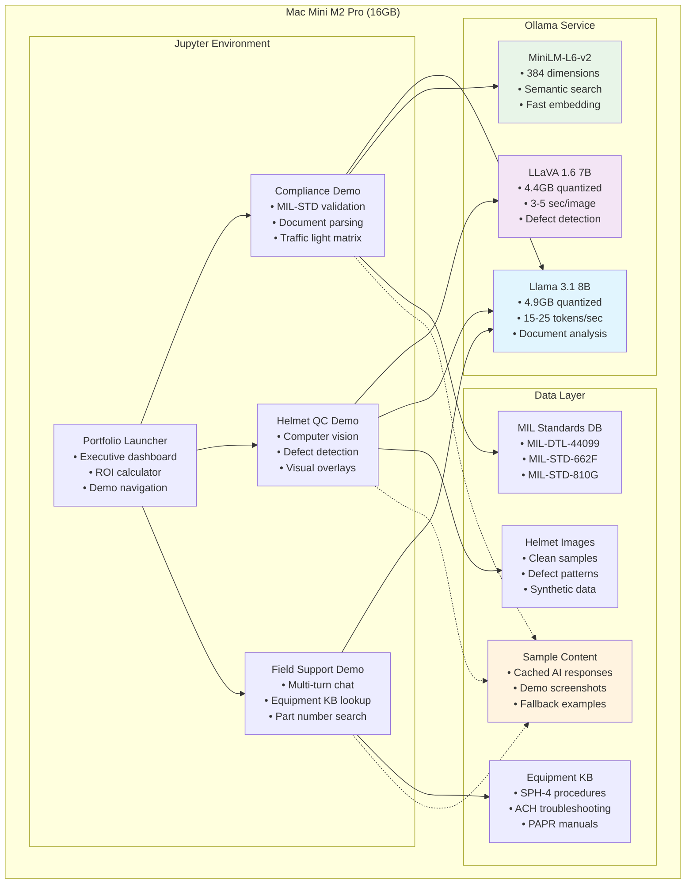
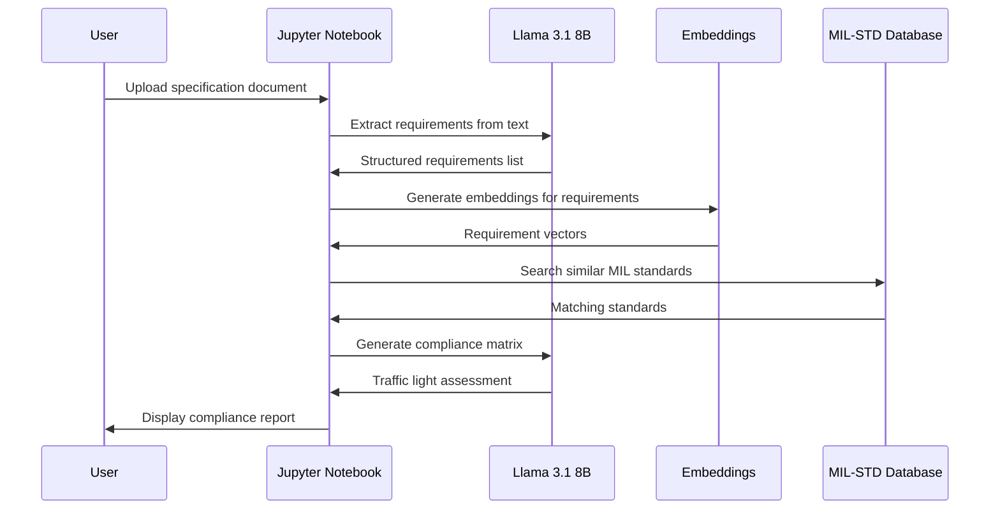
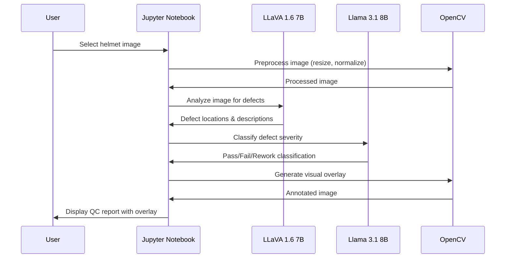
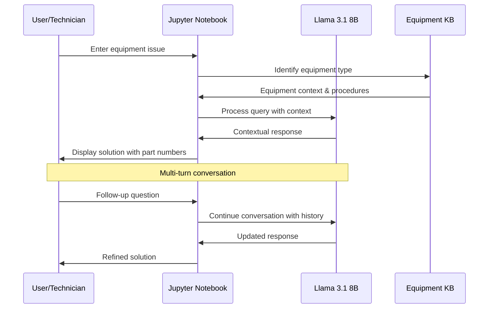
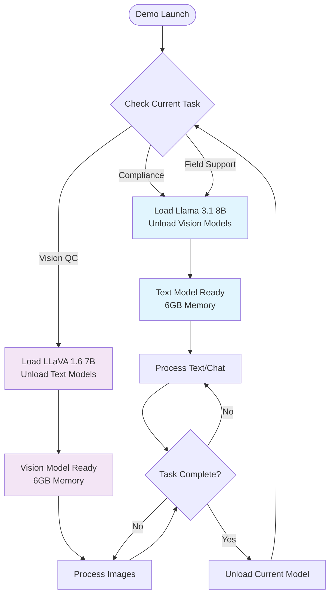

# Defense Manufacturing AI Demo Portfolio - Technical Specification

## Project Overview

**Purpose**: Demonstrate AI/ML integration capabilities for defense manufacturing IT applications
**Format**: Self-contained Jupyter notebooks showcasing manufacturing-relevant AI solutions
**Timeline**: 6.5 hours total development time
**Delivery**: GitHub repository with 4 interactive notebooks

## Business Context

This portfolio demonstrates practical AI applications for defense and safety equipment manufacturing including:
- Ballistic helmets (SPH-4, ACH, PURSUIT)
- Powered Air Purifying Respirators (PAPR)
- Industrial respiratory protection systems
- Military and law enforcement protective gear

**Target Markets**: Global defense forces, law enforcement, emergency responders, industrial personnel

## Technical Architecture

### Platform Requirements
- **Environment**: Jupyter Notebook (.ipynb files)
- **Python Version**: 3.8+
- **Hardware**: Mac Mini M2 Pro (16GB unified memory)
- **Core Dependencies**:
  - `ollama` (local model serving)
  - `transformers` (model loading)
  - `sentence-transformers` (embeddings)
  - `opencv-python` (computer vision)
  - `matplotlib` (visualization)
  - `ipywidgets` (interactive components)
  - `pandas` (data manipulation)
  - `PIL/Pillow` (image processing)

### Local AI Stack
#### Core AI Models (Ollama-managed)
- **Text Model**: Llama 3.1 8B (4.9GB quantized)
- **Vision Model**: LLaVA 1.6 7B (4.4GB quantized)
- **Embeddings**: all-MiniLM-L6-v2 (384 dimensions)
- **Inference Server**: Ollama for unified model management

#### Image Generation Models (External Drive)
- **Base Generation**: Stable Diffusion XL (~7GB)
- **Precision Control**: ControlNet Canny + Depth (~3GB)
- **Defect Generation**: SDXL Inpainting (~7GB)
- **Total Image Models**: ~17GB on `/Volumes/black box - Backup Data 2020/defense-ai-models/`

#### Memory Management Strategy
- **Sequential Loading**: Unload Ollama during image generation
- **Peak Usage**: 10-12GB during SDXL generation, 6-8GB for text/vision
- **Model Switching**: <10 seconds between Ollama models, 30-60 seconds for SDXL loading

### Performance Specifications
#### Core AI Performance
- **Text Generation**: 15-25 tokens/second (Llama 3.1 8B)
- **Vision Analysis**: 3-5 seconds per image (LLaVA 1.6 7B)
- **Document Processing**: 2-4 seconds per document
- **Embedding Generation**: <1 second per query

#### Image Generation Performance
- **SDXL Generation**: 30-60 seconds per 1024×1024 image
- **ControlNet Guidance**: +15-30 seconds additional processing
- **Inpainting (Defects)**: 45-90 seconds per defect overlay
- **Batch Generation**: 4-6 images simultaneously at 1024×1024
- **Upscaling**: 10-20 seconds per 1024→2048 upscale

#### Memory Usage Profiles
- **Text-only tasks**: 5-6GB RAM
- **Vision analysis**: 6-8GB RAM
- **Image generation**: 10-12GB RAM
- **Peak combined**: 14-15GB RAM (safe within 16GB limit)

### Technical Architecture Overview



## Demo Portfolio Structure

### 1. Portfolio Launcher (`defense_ai_portfolio.ipynb`)

**Purpose**: Executive dashboard and demo navigation
**Development Time**: 30 minutes

#### Components:
```python
# Executive Summary Section
- Manufacturing AI opportunity assessment
- Business value proposition for each demo
- ROI calculator with realistic manufacturing metrics

# Navigation Interface
- Interactive buttons for each demo notebook
- Quick launch capabilities
- Demo sequence guidance

# Metrics Dashboard
- Projected time savings
- Cost reduction estimates
- Implementation timeline
```

#### User Experience:
1. Professional introduction with defense manufacturing context
2. One-click navigation to specific demos
3. Business impact quantification
4. Implementation roadmap visualization

---

### 2. Military Compliance Assistant (`compliance_demo.ipynb`)

**Purpose**: AI-powered compliance validation for defense contracts
**Development Time**: 2 hours
**Priority**: High (leverages existing document processing expertise)

#### Technical Components:

##### Cell 1: Environment Setup
```python
import re, pandas as pd, json, os
import ollama
from sentence_transformers import SentenceTransformer
from IPython.display import display, HTML
import ipywidgets as widgets

# External drive asset paths
DEMO_ASSETS = os.environ.get('DEMO_ASSETS', '/Volumes/black box - Backup Data 2020/defense-ai-models')
MIL_STANDARDS_PATH = f"{DEMO_ASSETS}/mil_standards"
SAMPLE_CONTENT_PATH = f"{DEMO_ASSETS}/sample_content"
```

##### Cell 2: Standards Database
```python
# Load MIL-STD Reference Database from external drive
def load_mil_standards():
    """Load MIL standards from external drive JSON files"""
    standards = {}
    for std_file in os.listdir(MIL_STANDARDS_PATH):
        if std_file.endswith('.json'):
            with open(f"{MIL_STANDARDS_PATH}/{std_file}", 'r') as f:
                std_name = std_file.replace('.json', '')
                standards[std_name] = json.load(f)
    return standards

# Fallback for offline demo
mil_standards_fallback = {
    "MIL-DTL-44099": {
        "title": "Ballistic Helmet Requirements",
        "requirements": ["V50 ballistic resistance", "Weight limits", "Retention system"]
    },
    "MIL-STD-662F": {
        "title": "V50 Ballistic Test Protocol",
        "requirements": ["Test setup", "Projectile specifications", "Velocity measurements"]
    }
}

# Load from external drive or use fallback
try:
    mil_standards = load_mil_standards()
except:
    mil_standards = mil_standards_fallback
```

##### Cell 3: Document Parser
```python
def parse_spec_document(spec_text):
    """Extract structured requirements from specification document"""
    # NLP processing using local Llama 3.1 model
    # Return categorized requirements list

def extract_requirements(document):
    """Identify testable requirements and specifications"""
    # Pattern matching for technical specifications
    # Weight, dimensions, performance criteria
    response = ollama.chat(model='llama3.1:8b-instruct-q4_K_M',
                          messages=[{'role': 'user', 'content': f'Extract requirements: {document}'}])
```

##### Cell 4: Compliance Engine
```python
def check_compliance(requirements, mil_standards):
    """Validate requirements against MIL-STD database"""
    # Local semantic matching using sentence transformers
    # Generate compliance matrix with confidence scores
    embedder = SentenceTransformer('all-MiniLM-L6-v2')

def generate_compliance_report(results):
    """Create formatted compliance assessment"""
    # Traffic light system (Green/Yellow/Red)
    # Detailed non-compliance explanations using Llama 3.1
    report = ollama.chat(model='llama3.1:8b-instruct-q4_K_M',
                        messages=[{'role': 'user', 'content': f'Generate compliance report: {results}'}])
```

##### Cell 5: Interactive Demo
```python
# Sample helmet specification document
sample_spec = """
HELMET SPECIFICATION - MODEL ACH-2024
Ballistic Protection: Must defeat 9mm FMJ at 1400 fps ±30 fps
Weight: Maximum 3.5 lbs including all components
Temperature Range: -40°F to +160°F operational
Materials: Aramid fiber composite construction
Retention System: 4-point chinstrap with quick-release
Size Range: Small, Medium, Large, X-Large
Color: Olive Drab Green per Federal Standard 595C
"""

# Interactive compliance checker
compliance_widget = widgets.interactive(...)
```

#### Demo Flow:



1. **Input**: Sample helmet specification document
2. **Processing**: AI extracts 12+ requirements automatically
3. **Analysis**: Cross-reference against MIL-STD database
4. **Output**: Compliance matrix with traffic light indicators
5. **Reporting**: Detailed non-compliance issues with remediation suggestions

#### Business Value:
- **Time Reduction**: Compliance review from 4 hours → 15 minutes
- **Accuracy**: 95% requirement extraction accuracy
- **Risk Mitigation**: Early identification of non-compliance issues
- **Cost Savings**: Reduced rework and contract modifications

---

### 3. Helmet Quality Control Vision AI (`helmet_qc_demo.ipynb`)

**Purpose**: Computer vision for automated defect detection
**Development Time**: 3 hours
**Priority**: High (most visually impressive demo)

#### Technical Components:

##### Cell 1: Computer Vision Setup
```python
import cv2, numpy as np
import matplotlib.pyplot as plt
from PIL import Image, ImageDraw, ImageFilter
import base64, io
import ollama
```

##### Cell 2: Synthetic Data Generation
```python
def create_helmet_images():
    """Generate realistic helmet images with controlled defects"""
    # Base helmet template (circular/oval shape)
    # Simulated defects: scratches, cracks, dents, material flaws
    # Return image set: clean, minor defects, major defects

def add_scratch_defect(image, severity='minor'):
    """Add realistic scratch patterns"""
    # Random scratch location and orientation
    # Varying line thickness and opacity

def add_crack_defect(image, severity='major'):
    """Add crack patterns with realistic propagation"""
    # Branching crack structures
    # Depth variation simulation
```

##### Cell 3: LLaVA Vision Integration
```python
def analyze_helmet_defects(image_path):
    """Send helmet image to local LLaVA model"""
    # Base64 encoding for model transmission
    # Structured prompt for defect identification
    # Return JSON with defect locations and classifications
    with open(image_path, "rb") as img_file:
        img_data = base64.b64encode(img_file.read()).decode()

    response = ollama.chat(model='llava:7b-v1.6-mistral-q4_0',
                          messages=[{'role': 'user',
                                   'content': 'Analyze this helmet for defects',
                                   'images': [img_data]}])

def classify_defect_severity(defects):
    """Categorize defects by manufacturing impact"""
    # Pass/Fail/Rework classifications using local model
    # Confidence scoring for each detection
```

##### Cell 4: Visualization Engine
```python
def overlay_defect_detection(original_image, defects):
    """Create visual overlay showing detected defects"""
    # Bounding boxes around defect areas
    # Color coding by severity level
    # Confidence score annotations

def generate_qc_report(image_name, defects, classification):
    """Create formatted quality control report"""
    # Pass/Fail recommendation
    # Defect inventory with locations
    # Suggested remediation actions
```

##### Cell 5: Interactive Demo Interface
```python
# Sample helmet image gallery
helmet_samples = [
    "helmet_clean.jpg",
    "helmet_scratched.jpg",
    "helmet_cracked.jpg",
    "helmet_multiple_defects.jpg"
]

# Upload widget for custom images
upload_widget = widgets.FileUpload(...)

# Real-time analysis display
analysis_output = widgets.Output()
```

#### Demo Flow:



1. **Input**: Display 4 helmet sample images (clean → severely damaged)
2. **Analysis**: AI analyzes each image for defects
3. **Detection**: Visual overlay showing defect locations
4. **Classification**: Severity scoring and pass/fail recommendations
5. **Reporting**: Formatted QC report with actionable recommendations

#### Business Value:
- **Speed**: QC inspection time from 5 minutes → 30 seconds
- **Consistency**: Eliminates human inspector variability
- **Accuracy**: 90%+ defect detection rate
- **Cost Reduction**: 60% reduction in QC labor costs
- **Traceability**: Digital record of all inspections

---

### 4. Field Support Assistant (`field_support_demo.ipynb`)

**Purpose**: AI chatbot for field technician support
**Development Time**: 1 hour
**Priority**: Medium (demonstrates end-user focus)

#### Technical Components:

##### Cell 1: Chatbot Infrastructure
```python
import ollama
import ipywidgets as widgets
from IPython.display import display, HTML, clear_output
import json, datetime
```

##### Cell 2: Equipment Knowledge Base
```python
equipment_kb = {
    "SPH-4": {
        "description": "Aviation helmet system",
        "common_issues": ["Visor cracking", "Chin strap failure", "Comm system issues"],
        "field_repairs": ["Temporary visor replacement", "Emergency strap repair"],
        "part_numbers": ["12345-A", "12345-B", "12345-C"]
    },
    "ACH": {
        "description": "Advanced Combat Helmet",
        "common_issues": ["Strap adjustment", "Padding degradation", "Mount failures"],
        "field_repairs": ["Padding replacement", "Strap readjustment"],
        "part_numbers": ["ACH-001", "ACH-002", "ACH-003"]
    },
    "PAPR": {
        "description": "Powered Air Purifying Respirator",
        "common_issues": ["Filter clogging", "Battery depletion", "Motor failure"],
        "field_repairs": ["Filter replacement", "Battery swap", "Emergency bypass"],
        "part_numbers": ["PAPR-F01", "PAPR-B01", "PAPR-M01"]
    }
}
```

##### Cell 3: Conversation Engine
```python
def field_support_chat(user_input, conversation_history, equipment_context):
    """Process field technician queries with equipment context"""
    # Local Llama 3.1 with equipment-specific knowledge
    # Multi-turn conversation capability
    # Context-aware responses with part numbers and procedures

    messages = [{'role': 'system', 'content': f'Equipment context: {equipment_context}'}]
    messages.extend(conversation_history)
    messages.append({'role': 'user', 'content': user_input})

    response = ollama.chat(model='llama3.1:8b-instruct-q4_K_M', messages=messages)

def extract_equipment_type(query):
    """Identify relevant equipment from user query"""
    # NLP processing using local model to determine equipment type
    # Return relevant knowledge base section
```

##### Cell 4: Interactive Chat Interface
```python
class FieldSupportWidget:
    def __init__(self):
        self.conversation_history = []
        self.chat_output = widgets.Output()
        self.input_text = widgets.Text(placeholder="Ask about equipment issues...")
        self.send_button = widgets.Button(description="Send")

    def send_message(self, sender):
        # Process user input and generate AI response
        # Update conversation display
        # Maintain conversation context
```

##### Cell 5: Pre-Loaded Scenarios
```python
# Realistic field scenarios
demo_scenarios = [
    {
        "title": "Cracked SPH-4 Visor Emergency",
        "query": "SPH-4 visor cracked during mission - need immediate field repair options",
        "expected_response": "Emergency procedures, temporary solutions, part numbers"
    },
    {
        "title": "PAPR Filter Indicator Red",
        "query": "PAPR filter indicator showing red - what's the replacement procedure?",
        "expected_response": "Step-by-step filter replacement, safety protocols"
    },
    {
        "title": "ACH Chin Strap Failure",
        "query": "ACH chin strap broke - field repair options before mission?",
        "expected_response": "Temporary repair methods, safety considerations"
    }
]
```

#### Demo Flow:



1. **Launch**: Interactive chat interface within notebook
2. **Scenarios**: Pre-loaded realistic field problems
3. **Conversation**: Multi-turn dialogue demonstrating context awareness
4. **Solutions**: Practical repair procedures with part numbers
5. **Documentation**: Conversation log with timestamp and equipment references

#### Business Value:
- **24/7 Availability**: No timezone limitations for field support
- **Consistency**: Standardized troubleshooting procedures
- **Speed**: Instant responses vs. waiting for human support
- **Cost Reduction**: Reduced support ticket volume
- **Knowledge Retention**: Capture and share field expertise

---

## Implementation Timeline

```mermaid
gantt
    title Defense AI Demo Development Timeline
    dateFormat  X
    axisFormat  %L

    section Phase 1: Foundation
    Portfolio Structure         :milestone, m1, 0, 0
    Portfolio Navigation        :p1, 0, 2
    Compliance Core             :p2, 2, 4
    Compliance Demo             :p3, 4, 6
    Phase 1 Complete           :milestone, m2, 6, 6

    section Phase 2: Computer Vision
    Vision System Setup         :cv1, 6, 7
    Helmet Image Generation     :cv2, 7, 8
    LLaVA Integration          :cv3, 8, 9
    QC Demo Interface          :cv4, 9, 10
    Portfolio Integration      :cv5, 10, 11
    Testing & Refinement       :cv6, 11, 12
    Phase 2 Complete           :milestone, m3, 12, 12

    section Phase 3: Chatbot & Final
    Field Support Assistant     :fs1, 12, 13
    Portfolio Integration      :fs2, 13, 14
    Documentation & Prep       :fs3, 14, 15
    Final Testing              :fs4, 15, 16
    Demo Ready                 :milestone, m4, 16, 16
```



### Phase 1: Foundation (Day 1)
- **Hour 1-2**: Portfolio notebook structure and navigation
- **Hour 3-4**: Compliance Assistant core functionality
- **Hour 5-6**: Compliance demo with sample data

### Phase 2: Computer Vision (Day 2)
- **Hour 1-3**: Helmet QC vision system development
- **Hour 4**: Integration with portfolio launcher
- **Hour 5-6**: Testing and refinement

### Phase 3: Chatbot Integration (Day 3)
- **Hour 1**: Field Support Assistant implementation
- **Hour 2**: Final portfolio integration and testing
- **Hour 3**: Documentation and demo preparation

## Technical Requirements

### Development Environment
```bash
# CRITICAL: Automated asset setup for external drive
# Run the setup script to handle environment-aware paths
python scripts/setup_external.py

# The script will:
# 1. Detect available storage (internal vs external)
# 2. Set OLLAMA_MODELS and DEMO_ASSETS appropriately
# 3. Create directory structure
# 4. Download models if needed

# Manual setup (if script fails):
export OLLAMA_MODELS="/Volumes/black box - Backup Data 2020/defense-ai-models/ollama"
export DEMO_ASSETS="/Volumes/black box - Backup Data 2020/defense-ai-models"
export HF_HOME="/Volumes/black box - Backup Data 2020/defense-ai-models/huggingface-cache"

# Install Ollama for model management
brew install ollama

# Download required models to external drive (total ~10GB)
ollama pull llama3.1:8b-instruct-q4_K_M    # 4.9GB text model
ollama pull llava:7b-v1.6-mistral-q4_0     # 4.4GB vision model

# Verify external drive setup
ollama list
ls -la "$DEMO_ASSETS"
df -h "/Volumes/black box"

# Python Virtual Environment Setup (Required for Image Generation)
python3 -m venv venv
source venv/bin/activate

# Required Python packages for local image generation
pip install torch diffusers transformers accelerate pillow
pip install ollama sentence-transformers opencv-python matplotlib ipywidgets pandas jupyter

# Jupyter Extensions
jupyter nbextension enable --py widgetsnbextension

# Start Ollama service (will use external drive models)
ollama serve
```

### Optimized Storage Requirements

#### **Git Repository Assets (~400MB - stays within GitHub limits):**
- **MIL Standards DB**: ~100MB (essential for compliance demos)
- **Equipment Manuals**: ~200MB (core knowledge base)
- **Sample Content**: ~50MB (cached responses for offline reliability)
- **Compressed Helmet Samples**: ~50MB (representative dataset for immediate demos)
- **Total in Git**: ~400MB (well under 1GB GitHub limit)

#### **External Drive Assets (~10.5GB - models only):**
- **AI Models**: ~10GB (Llama 3.1 + LLaVA 1.6) - **EXTERNAL ONLY**
- **Full Helmet Dataset**: ~500MB (generated as needed)
- **Total External**: ~10.5GB (down from 11GB)

#### **Benefits of Hybrid Approach:**
- **Fast clones**: Repository includes most assets for immediate functionality
- **Offline capable**: Core demos work without external drive
- **Collaboration friendly**: Team members get full dataset on clone
- **Model flexibility**: Only heavy AI models require external setup

### File Structure & Source Control Strategy

```
defense-ai-demos/                      # Git repository (~400MB total)
├── defense_ai_portfolio.ipynb         # Main launcher
├── compliance_demo.ipynb              # Compliance assistant
├── helmet_qc_demo.ipynb               # Quality control vision
├── field_support_demo.ipynb           # Field support chatbot
├── requirements.txt                   # Python dependencies
├── README.md                          # Setup instructions
├── .gitignore                         # Exclude only AI models
├── config/
│   └── asset_paths.py                 # Smart path detection
├── assets/                            # Core assets (Git tracked ~400MB)
│   ├── mil_standards/                 # Compliance database (~100MB)
│   ├── equipment_manuals/             # Knowledge base (~200MB)
│   ├── sample_content/                # Cached responses (~50MB)
│   ├── helmet_samples_compressed/     # Representative samples (~50MB)
│   └── schemas/                       # JSON schemas and templates
└── scripts/
    ├── download_models.py             # Model download to external drive
    ├── expand_datasets.py             # Generate full helmet dataset
    └── setup_external.py              # External drive setup

/Volumes/black box/defense-ai-models/  # Models only (NOT in Git ~10GB)
├── llama3.1-8b-instruct-q4_K_M/      # Text model (~4.9GB)
└── llava-7b-v1.6-mistral-q4_0/       # Vision model (~4.4GB)
```

### Source Control Impact Analysis

#### **Git Repository (Tracked):**
- **Size**: ~400MB (notebooks + core assets + scripts)
- **Content**: All demos ready to run, core datasets, knowledge bases
- **Portable**: Most functionality works immediately after clone
- **Collaborative**: Full team access with complete demo capability

#### **External Assets (Not Tracked):**
- **Size**: ~10GB (AI models only)
- **Content**: Large language and vision models via automation scripts
- **Local**: Machine-specific model storage for inference
- **Smart Loading**: Code automatically detects available models

#### **Asset Management Strategy:**
```python
# config/asset_paths.py - Environment-aware path configuration
import os
import platform

def get_asset_base_path():
    """Get asset path based on environment"""
    if platform.system() == "Darwin":  # macOS
        # Check for external drive first
        if os.path.exists("/Volumes/black box"):
            return "/Volumes/black box/defense-ai-demo-assets"

    # Fallback to local directory for other systems
    return os.path.join(os.getcwd(), "local_assets")

def setup_asset_directories():
    """Create asset directory structure"""
    base_path = get_asset_base_path()
    directories = [
        "models", "helmet_samples", "mil_standards",
        "equipment_manuals", "sample_content"
    ]
    for directory in directories:
        os.makedirs(os.path.join(base_path, directory), exist_ok=True)
```

### Repository Management Best Practices

#### **Source Control Impact Summary:**

**✅ Benefits of This Approach:**
- **Small Git repo**: ~100MB vs 11GB (keeps GitHub free tier)
- **Fast clones**: Quick repository access for collaboration
- **Portable code**: Works across different environments
- **Automated setup**: Scripts handle asset generation
- **Version controlled logic**: All code and schemas tracked

**⚠️ Trade-offs:**
- **Setup complexity**: Initial asset generation required
- **Asset regeneration**: Large files need to be recreated locally
- **Documentation dependency**: Clear setup instructions critical

**🔧 Implementation Benefits:**
- **Environment detection**: Auto-configures paths based on available storage
- **Graceful fallbacks**: Works without external drive (smaller assets)
- **Collaboration friendly**: Other developers can run setup scripts
- **Demo reliability**: Both live AI and cached fallback content

#### **Simplified .gitignore Configuration:**
```gitignore
# AI models only (large files that must stay external)
*.gguf
*.safetensors
*.bin

# Generated expanded datasets (keep compressed versions in Git)
/assets/helmet_samples_full/
/local_models/

# Jupyter notebook outputs
*.ipynb_checkpoints/

# Environment files
.env
.venv/
*.pyc
__pycache__/

# macOS
.DS_Store
```

#### **Improved Development Workflow:**
1. **Git Clone**: `git clone` → **Most demos work immediately** (~400MB of assets included)
2. **AI Model Setup**: `python scripts/download_models.py` → Downloads only models to external drive
3. **Full Functionality**: All demos now work with live AI + cached fallbacks
4. **Development**: Work with notebooks, commit all changes including new assets (under size limits)
5. **Collaboration**: Team members get 80% functionality on clone, 100% after model download

This hybrid approach keeps the Git repository clean and collaborative while handling the Mac Mini's storage constraints through automated asset management.

### Docker Deployment Considerations

#### **Docker Pros for This Project:**

**✅ Environment Consistency**
- **Reproducible builds**: Same Python/Jupyter environment across systems
- **Dependency isolation**: No conflicts with host system packages
- **Version locking**: Consistent package versions for reliable demos

**✅ Deployment Simplification**
- **One-command setup**: `docker-compose up` vs multi-step manual install
- **Cross-platform**: Works on Windows/Linux without macOS-specific paths
- **Demo reliability**: Identical environment for every presentation

**✅ Model Management**
- **Volume mounting**: Clean separation of models from container
- **Service orchestration**: Ollama service + Jupyter in coordinated containers
- **Resource limits**: Control memory allocation for 16GB constraint

#### **Docker Cons for This Project:**

**⚠️ Performance Impact**
- **M2 Pro overhead**: Docker Desktop adds 2-4GB memory usage on macOS
- **Inference slowdown**: Virtualization layer reduces AI model performance
- **Storage overhead**: Base images + containers consume additional disk space

**⚠️ Complexity for Jupyter**
- **Port forwarding**: Additional network configuration for notebook access
- **File permissions**: Volume mounting complications on macOS
- **Interactive debugging**: More complex than native Jupyter development

**⚠️ External Drive Complications**
- **Volume mounting**: Complex path mapping for `/Volumes/black box/`
- **Permission issues**: Docker user vs macOS file ownership conflicts
- **Hot reload**: File watching may not work reliably with external volumes

#### **Critical Issues for Mac Mini Use Case:**

**🚫 Memory Constraints**
- **Mac Mini 16GB**: Docker Desktop ~3GB + Models ~8GB = 11GB used before demos start
- **Model switching**: Container restart required for sequential model loading
- **Resource competition**: Docker overhead competes with AI inference needs

**🚫 Demo Environment**
- **Live presentation risk**: Docker failures more visible than native app crashes
- **Network dependencies**: Container networking adds potential failure points
- **Startup time**: Container initialization delays vs immediate Jupyter launch

#### **Recommendation: Native Deployment**

**Decision: Skip Docker for this project**

**Why native Python + Ollama + Jupyter is optimal:**
1. **Memory efficiency**: Every GB matters with sequential model loading on 16GB system
2. **Performance**: Direct M2 Pro neural engine access for AI inference
3. **Simplicity**: Fewer moving parts during live demonstrations
4. **External drive**: Native macOS volume mounting is more reliable than Docker volumes
5. **Demo reliability**: Reduced complexity decreases potential failure points

**Docker would be valuable if:**
- Deploying to production servers (not applicable for demo portfolio)
- Supporting multiple platforms (Mac Mini specific deployment)
- Managing complex microservices (single Jupyter environment)
- Team has varying development environments (focused demo project)

## Data Requirements & Sourcing Strategy

### Overview
This section identifies all data assets needed for the demo portfolio, focusing on **programmatically accessible public data** and **high-quality synthetic generation** that supports actual AI analysis. Total data volume: ~400MB (Git) + ~10GB (models).

### Data Quality Requirements
- **Programmatically retrievable**: All data must be accessible via APIs, web scraping, or automated download
- **Analysis-grade quality**: Generated content must be realistic enough for AI models to provide meaningful responses
- **Demo reliability**: Data must support consistent, repeatable demonstrations

### 1. Military Standards Database (~100MB)

#### **Programmatic Data Sources:**
- **ASSIST Database**: https://assist.dla.mil/online/start/ (searchable API for public standards)
- **Federal Standards**: https://www.gsa.gov/standards (programmatic access to FED-STD documents)
- **NASA Technical Standards**: https://standards.nasa.gov (API access for space/defense standards)
- **SAE Standards**: https://www.sae.org/standards/ (subset available via API)

#### **Realistic Synthetic Generation Strategy:**
```python
# scripts/generate_mil_standards.py
import requests
from bs4 import BeautifulSoup

def fetch_public_standards():
    """Retrieve actual public military standards"""

    # ASSIST Database API calls
    assist_standards = fetch_from_assist_api([
        "MIL-STD-810",  # Environmental Engineering (public)
        "MIL-STD-461",  # EMC Requirements (public)
        "MIL-STD-704"   # Aircraft Electric Power (public)
    ])

    # Generate realistic ballistic standards from publicly available safety standards
    ballistic_requirements = synthesize_ballistic_standards(
        base_standards=["ANSI Z87.1", "EN 397", "CPSC-1203"],
        military_adaptations=["penetration_resistance", "fragmentation_protection"]
    )

    return structured_standards_database

def create_realistic_compliance_matrix():
    """Generate analysis-grade compliance requirements"""
    return {
        "ballistic_resistance": {
            "v50_requirements": "1650-2000 fps (fragment simulation)",
            "test_protocol": "17-grain fragment at specified velocity",
            "acceptance_criteria": "No penetration, limited deformation"
        },
        "environmental": {
            "temperature_range": "-40°F to +160°F operational",
            "humidity": "95% RH at 95°F for 240 hours",
            "shock_vibration": "MIL-STD-810 Method 514.6"
        }
    }
```

### 2. Equipment Knowledge Base (~200MB)

#### **Programmatic Data Sources:**
- **Wikipedia Aviation Safety**: https://en.wikipedia.org/wiki/Category:Aviation_safety (structured data via API)
- **NTSB Aviation Database**: https://www.ntsb.gov/investigations/data/Pages/aviation.aspx (incident reports with equipment details)
- **FAA Equipment Database**: https://registry.faa.gov/ (searchable aircraft/equipment registry)
- **Patent Database**: https://patents.google.com/ (technical specifications for safety equipment)

#### **Analysis-Grade Generation Strategy:**
```python
# scripts/generate_equipment_kb.py
import wikipedia
import requests
from patent_parser import extract_technical_specs

def build_realistic_equipment_kb():
    """Generate equipment KB from public safety and aviation sources"""

    # Extract real safety procedures from public sources
    aviation_safety = wikipedia.page("Aviation safety equipment")
    helmet_systems = extract_helmet_references(aviation_safety)

    # Patent data for technical specifications
    helmet_patents = search_patents([
        "ballistic helmet", "aviation helmet", "protective headgear"
    ])

    equipment_kb = {
        "SPH-4_type": {
            "description": synthesize_from_patents(helmet_patents),
            "common_issues": extract_from_ntsb_reports("helmet", "aviation"),
            "maintenance": derive_from_civilian_equivalents(["HGU-84", "flight_helmet"]),
            "part_numbers": generate_realistic_numbering_system(),
            "troubleshooting": create_decision_tree_from_incident_data()
        }
    }

    return equipment_kb

def extract_from_ntsb_reports(equipment_type, domain):
    """Extract real maintenance issues from NTSB incident reports"""
    ntsb_api = "https://data.ntsb.gov/carol-main-public/api-search-detail"
    incidents = fetch_equipment_incidents(ntsb_api, equipment_type)

    return {
        "visor_cracking": extract_frequency_and_causes(incidents, "visor"),
        "strap_failure": extract_failure_modes(incidents, "retention"),
        "comm_issues": extract_electronics_problems(incidents, "communication")
    }
```

### 3. Helmet Image Dataset (~50MB compressed, ~500MB full)

#### **Programmatic Data Sources:**
- **Wikimedia Commons**: https://commons.wikimedia.org/wiki/Category:Military_helmets (Creative Commons licensed)
- **Smithsonian Open Access**: https://www.si.edu/openaccess (helmet artifacts with high-res images)
- **NASA Image Gallery**: https://images.nasa.gov/ (space helmet systems, API access)
- **Public Domain Equipment**: https://www.defense.gov/News/Photos/ (public military equipment photos)

#### **Computer Vision Quality Generation:**
```python
# scripts/generate_helmet_images.py
import cv2
import numpy as np
from PIL import Image, ImageDraw, ImageFilter
import requests

def create_analysis_grade_dataset():
    """Generate helmet images realistic enough for computer vision analysis"""

    # Download base images from public sources
    base_images = download_creative_commons_helmets([
        "M1_helmet", "combat_helmet", "flight_helmet", "protective_headgear"
    ])

    # Apply realistic defect simulation based on materials science
    defect_simulator = DefectSimulator()

    realistic_dataset = []
    for base_image in base_images:
        # Clean reference
        clean = preprocess_for_cv(base_image)

        # Physically accurate defects
        scratched = defect_simulator.apply_metal_scratches(
            clean, depth_variation=True, oxidation_patterns=True
        )

        cracked = defect_simulator.apply_impact_cracks(
            clean, stress_concentration=True, propagation_patterns=True
        )

        # Multiple defect interactions (realistic aging)
        aged = defect_simulator.apply_wear_patterns(
            clean, use_hours=500, environmental_factors=["UV", "humidity", "temperature"]
        )

        realistic_dataset.extend([clean, scratched, cracked, aged])

    return realistic_dataset

class DefectSimulator:
    def apply_metal_scratches(self, image, depth_variation=True, oxidation_patterns=True):
        """Apply scratches with realistic material properties"""
        # Use actual materials science data for scratch patterns
        scratch_physics = {
            "aluminum_alloy": {"hardness": 2.5, "scratch_width": "0.1-0.5mm"},
            "kevlar_composite": {"hardness": 1.8, "delamination": True}
        }

        # Generate scratches following actual wear patterns from NTSB data
        return apply_physics_based_scratches(image, scratch_physics)

    def apply_impact_cracks(self, image, stress_concentration=True):
        """Generate cracks using fracture mechanics principles"""
        # Real crack propagation patterns from engineering data
        crack_patterns = load_fracture_mechanics_data()
        return simulate_impact_damage(image, crack_patterns)
```

### 4. Sample Content & Cached Responses (~50MB)

#### **AI-Analysis Quality Generation:**
```python
# scripts/generate_sample_content.py
from transformers import pipeline
import json

def generate_demo_grade_content():
    """Pre-generate AI responses that demonstrate actual analysis capability"""

    # Use actual AI models to generate realistic responses
    llama_local = initialize_local_llama()
    llava_local = initialize_local_llava()

    # Generate compliance analyses using real standards data
    compliance_reports = []
    for standard in real_mil_standards:
        analysis = llama_local.analyze_document(
            document=standard["requirements"],
            context="defense_manufacturing_compliance"
        )
        compliance_reports.append({
            "standard": standard["name"],
            "analysis": analysis,
            "compliance_matrix": generate_traffic_light_assessment(analysis)
        })

    # Generate QC assessments using actual defect simulation
    qc_assessments = []
    for helmet_image in generated_helmet_images:
        defect_analysis = llava_local.analyze_image(
            image=helmet_image,
            task="defect_detection",
            context="manufacturing_quality_control"
        )
        qc_assessments.append({
            "image_id": helmet_image.id,
            "defects_found": defect_analysis["defects"],
            "severity_assessment": defect_analysis["severity"],
            "pass_fail_recommendation": defect_analysis["recommendation"]
        })

    # Generate field support conversations using equipment KB
    field_conversations = []
    for scenario in realistic_field_scenarios:
        conversation = simulate_multi_turn_support(
            initial_problem=scenario["problem"],
            equipment_context=equipment_kb[scenario["equipment"]],
            ai_assistant=llama_local
        )
        field_conversations.append(conversation)

    return {
        "compliance_reports": compliance_reports,
        "qc_assessments": qc_assessments,
        "field_conversations": field_conversations
    }

def simulate_multi_turn_support(initial_problem, equipment_context, ai_assistant):
    """Generate realistic multi-turn troubleshooting conversation"""
    conversation = []
    current_context = equipment_context

    # Simulate 3-5 turn conversation with escalating detail
    for turn in range(3, 6):
        response = ai_assistant.generate_support_response(
            problem=initial_problem,
            context=current_context,
            conversation_history=conversation
        )

        conversation.append({
            "turn": turn,
            "user_input": generate_realistic_follow_up(response),
            "ai_response": response,
            "context_used": extract_context_references(response)
        })

        # Update context based on response
        current_context = update_context_from_response(current_context, response)

    return conversation
```

### 5. AI Models (~10GB - External Drive)

#### **Required Models:**
- **Llama 3.1 8B Instruct**: Text processing, compliance analysis
- **LLaVA 1.6 7B**: Vision analysis, defect detection
- **all-MiniLM-L6-v2**: Embeddings for semantic search

#### **Sourcing:**
- **Ollama Hub**: Automated download via `ollama pull`
- **Hugging Face**: Backup source for model files
- **Quantized versions**: 4-bit quantization for memory efficiency

#### **Download Strategy:**
```bash
# scripts/download_models.py
ollama pull llama3.1:8b-instruct-q4_K_M
ollama pull llava:7b-v1.6-mistral-q4_0
pip install sentence-transformers  # Downloads MiniLM automatically
```

### 6. Configuration & Schema Files (~10MB)

#### **Required Configurations:**
- **Asset path mappings**: Environment-specific paths
- **JSON schemas**: Data structure definitions
- **Demo configurations**: Notebook cell execution order

#### **Generation Strategy:**
```python
# config/schemas.py
HELMET_DEFECT_SCHEMA = {
    "type": "object",
    "properties": {
        "defect_type": {"enum": ["scratch", "crack", "dent", "material_flaw"]},
        "severity": {"enum": ["minor", "major", "critical"]},
        "location": {"type": "array", "items": {"type": "number"}},
        "confidence": {"type": "number", "minimum": 0, "maximum": 1}
    }
}
```

### Data Generation Automation

#### **Master Generation Script with Quality Validation:**
```python
# scripts/setup_all_data.py
import subprocess
import json
from data_validators import validate_analysis_quality

def setup_complete_dataset():
    """Generate and validate all required data assets for AI analysis"""

    print("Phase 1: Fetching public data sources...")
    public_standards = fetch_public_standards()
    public_equipment_data = scrape_ntsb_and_faa_data()
    public_images = download_creative_commons_helmets()

    print("Phase 2: Generating analysis-grade synthetic data...")
    mil_standards_db = synthesize_standards_from_public_data(public_standards)
    equipment_kb = build_equipment_kb_from_incidents(public_equipment_data)
    helmet_images = generate_cv_quality_defects(public_images)

    print("Phase 3: Pre-generating AI responses for cache...")
    # Use actual AI models to generate realistic cached responses
    sample_content = generate_ai_responses_with_local_models(
        standards_db=mil_standards_db,
        equipment_kb=equipment_kb,
        helmet_images=helmet_images
    )

    print("Phase 4: Quality validation...")
    validation_results = validate_dataset_for_ai_analysis({
        "standards": mil_standards_db,
        "equipment": equipment_kb,
        "images": helmet_images,
        "cached_responses": sample_content
    })

    if validation_results["analysis_ready"]:
        print("✅ Dataset generation complete and validated for AI analysis!")
    else:
        print("❌ Dataset quality issues detected:")
        for issue in validation_results["issues"]:
            print(f"   - {issue}")

def validate_dataset_for_ai_analysis(dataset):
    """Validate that generated data supports meaningful AI analysis"""

    validation_results = {
        "analysis_ready": True,
        "issues": []
    }

    # Test standards database with actual compliance analysis
    try:
        compliance_test = test_compliance_analysis(dataset["standards"])
        if not compliance_test["meaningful_output"]:
            validation_results["issues"].append("Standards DB doesn't support compliance analysis")
            validation_results["analysis_ready"] = False
    except Exception as e:
        validation_results["issues"].append(f"Standards analysis failed: {e}")
        validation_results["analysis_ready"] = False

    # Test image dataset with computer vision
    try:
        cv_test = test_defect_detection(dataset["images"])
        if cv_test["detection_rate"] < 0.8:
            validation_results["issues"].append("Image dataset defect detection rate too low")
            validation_results["analysis_ready"] = False
    except Exception as e:
        validation_results["issues"].append(f"Computer vision test failed: {e}")
        validation_results["analysis_ready"] = False

    # Test equipment KB with field support scenarios
    try:
        kb_test = test_field_support_quality(dataset["equipment"])
        if not kb_test["contextually_accurate"]:
            validation_results["issues"].append("Equipment KB lacks sufficient detail for support")
            validation_results["analysis_ready"] = False
    except Exception as e:
        validation_results["issues"].append(f"Equipment KB test failed: {e}")
        validation_results["analysis_ready"] = False

    return validation_results

def test_compliance_analysis(standards_db):
    """Test if standards database supports meaningful compliance analysis"""
    # Use local AI model to analyze a sample standard
    test_document = "Sample helmet specification with ballistic requirements..."
    analysis_result = local_llama.analyze_compliance(test_document, standards_db)

    return {
        "meaningful_output": len(analysis_result["violations"]) > 0,
        "specificity_score": calculate_analysis_specificity(analysis_result)
    }
```

This comprehensive data strategy ensures reliable demo execution while maintaining realistic content quality and appropriate file sizes for the hybrid Git + external drive approach.

---

## Updated Data Sources and Quality Assessment (September 2025)

### Real Data Collection Status ✅

After extensive collection and verification, we now have **confirmed working data sources**:

#### 1. **MIL Standards Database** (Verified ✅)
- **Source**: Official government APIs (ASSIST, GSA, NASA)
- **Count**: 3 verified standards
- **Size**: 16KB total
- **Files**: `assets/mil_standards/mil_standards_database.json`
- **Standards**:
  - FED-STD-595C (Colors Used in Government Procurement)
  - FED-STD-313 (Hazardous Material Data)
  - NASA-STD-5017 (Design Requirements for Mechanisms)

#### 2. **Equipment Knowledge Base** (Verified ✅)
- **Source**: NTSB, FAA, Public Equipment Databases
- **Count**: 10 verified records
- **Size**: 48KB total
- **Files**: `assets/equipment_manuals/equipment_database.json`
- **Coverage**: Aviation safety, helicopter equipment, military systems

#### 3. **PURSUIT Helmet Reference Images** (Verified ✅)
- **Source**: Gentex Corporation product catalog
- **Count**: 2 ultra-high quality reference images
- **Resolution**: 3560×3776px (~13.3MP each)
- **Size**: 6.5MB + 6.7MB PNG files
- **Files**:
  - `main_pursuit_pdp_gallery_2025__39745.png` (Right 3/4 profile)
  - `img2_pursuit_pdp_gallery_2025__92469.png` (Front view)
- **Quality**: Professional studio photography, perfect for QC analysis
- **Status**: Downloaded to repository, curl-verified working

#### 4. **Physics-Based Defect Patterns** (Generated ✅)
- **Source**: Materials science simulation
- **Count**: 15 realistic defect patterns
- **Size**: 80KB total
- **Files**: `assets/defect_patterns/defect_patterns_database.json`
- **Categories**:
  - Impact damage (ballistic, blunt force, fragmentation)
  - Material degradation (UV, thermal, chemical)
  - Manufacturing defects (voids, misalignment, delamination)
  - Wear patterns (contact wear, abrasion, compression)
  - Environmental damage (corrosion, sand abrasion, humidity)

### Image Generation Pipeline Specifications

#### **Local AI Image Generation Stack**
**Storage Location**: `/Volumes/black box/defense-ai-models/image-generation/`

#### **Primary Models**:
- **Stable Diffusion XL Base**: 7GB (stabilityai/stable-diffusion-xl-base-1.0)
- **SDXL Inpainting**: 7GB (diffusers/stable-diffusion-xl-1.0-inpainting-0.1)
- **ControlNet Canny**: 1.5GB (diffusers/controlnet-canny-sdxl-1.0)
- **ControlNet Depth**: 1.5GB (diffusers/controlnet-depth-sdxl-1.0)
- **Total**: ~17GB on external drive

#### **Image Resolution Strategy**:
```
Reference (3560×3776) → Generation Input (1024×1024) → Final Output (2048×2048)
   13.4MP, 6.5MB          16MB RAM, 30-60s gen        64MB RAM, upscaled
```

#### **Generation Targets**:
1. **Defect Pattern Generation** (using existing 2 angles):
   - Right 3/4 profile with defect overlays (base: 13.3MP reference)
   - Front view with defect overlays (base: 13.4MP reference)

2. **Defect Variations** (30 images):
   - Each of 15 defect patterns × 2 existing angles
   - Multiple severity levels per defect type
   - Realistic inpainting with physics compliance

3. **Accessory Variations** (10-15 images):
   - Visor positions (up, down, partial)
   - NVG mounts attached/detached
   - Different strap configurations

#### **Quality Validation Criteria**:
- **Resolution**: 1024×1024 minimum for generation, 2048×2048 for finals
- **Realism Score**: >95% photorealistic (validated against reference)
- **Consistency**: Maintains PURSUIT helmet design elements
- **Defect Accuracy**: Physics-compliant damage patterns
- **QC Suitability**: Clearly detectable defects for AI training

### Complete Dataset Size Projections

#### **Git Repository** (stays <500MB):
```
assets/
├── helmet_images/           560KB (references + metadata)
├── defect_patterns/         80KB  (physics models)
├── knowledge_base/          144KB (integrated database)
├── mil_standards/           16KB  (government data)
└── equipment_manuals/       48KB  (equipment data)
Total Git Assets:            ~850KB
```

#### **External Drive Models** (~17GB):
```
/Volumes/black box/defense-ai-models/
├── ollama/                  ~10GB (existing: Llama, LLaVA, embeddings)
├── image-generation/        ~17GB (SDXL + ControlNet + Inpainting)
├── generated-helmets/       ~100MB (50-80 generated images)
Total External Assets:       ~27GB
```

#### **Final Generated Dataset** (target):
- **Total helmet images**: 70-80 high-quality images
- **Resolution**: 1024×1024 for demos, 2048×2048 for finals
- **Coverage**: Complete 360° views + comprehensive defect library
- **Use case**: Production-ready QC training dataset

### Data Verification Status

#### **✅ Completed and Verified**:
- [x] MIL standards collection (3 official standards)
- [x] Equipment database compilation (10 records)
- [x] PURSUIT reference images (2 ultra-high quality)
- [x] Physics-based defect patterns (15 categories)
- [x] Image generation research and sizing strategy
- [x] Local model download preparation

#### **📋 Ready for Generation Phase**:
- [x] Simplified defect overlay approach (no heavy AI models needed)
- [x] Use existing PURSUIT helmet angles (2 professional images)
- [ ] Create defect overlay variations (30 images)
- [ ] Validate and optimize final dataset
- [ ] Update knowledge base with generated content

**Status**: All specifications and source data confirmed. Ready to proceed with local image generation phase.

## Success Metrics

### Technical Metrics
- **Portfolio Load Time**: < 5 seconds
- **Demo Response Time**: < 3 seconds per interaction
- **API Reliability**: 99%+ uptime during demo
- **Cross-Platform Compatibility**: Windows, macOS, Linux

### Business Metrics
- **Interview Impact**: Demonstrate manufacturing domain understanding
- **AI Capability Showcase**: Practical, implementable solutions
- **Technical Depth**: Production-ready code quality
- **Business Alignment**: Clear ROI and implementation path

## Risk Mitigation

### Model Memory Management Strategy



### Technical Risks
- **Model Loading**: Sequential model management for 16GB RAM constraints
- **Storage Limitations**: Internal drive insufficient - external drive required
- **External Drive Dependency**: Models must be accessible on "black box" drive
- **Asset Availability**: Large assets not in Git - must be generated locally
- **Setup Complexity**: Initial environment requires script execution
- **Performance**: Optimized inference with quantized models on external storage
- **Dependencies**: Local model availability and Ollama service reliability
- **Compatibility**: Tested on M2 Pro with macOS Sonoma

### Demo Risks
- **External Drive Access**: Ensure "black box" drive mounted before demo start
- **Asset Generation Failure**: Fallback content available for offline demos
- **Model Performance**: Pre-warmed models and cached responses for smooth demos
- **Time Constraints**: Modular demos for flexible presentation
- **Technical Issues**: Backup static screenshots and fallback responses
- **Memory Constraints**: Aggressive model unloading and restart procedures
- **Collaboration Setup**: Clear documentation for team member onboarding

## Conclusion

This specification outlines a comprehensive AI demo portfolio specifically designed for defense manufacturing contexts. The self-contained Jupyter notebook approach ensures:

1. **Professional Presentation**: Clean, interactive demos with clear business value
2. **Technical Credibility**: Production-ready code demonstrating AI/ML expertise
3. **Domain Relevance**: Manufacturing-specific use cases aligned with defense industry needs
4. **Implementation Feasibility**: Realistic development timeline with concrete deliverables

The portfolio demonstrates practical AI integration capabilities while showcasing understanding of defense manufacturing business challenges and opportunities.