# Defense Manufacturing AI Demo Portfolio - Technical Specification

## Project Overview

**Purpose**: Demonstrate AI/ML integration capabilities for defense manufacturing IT applications
**Format**: Self-contained Jupyter notebooks showcasing manufacturing-relevant AI solutions
**Timeline**: 6.5 hours total development time
**Delivery**: GitHub repository with 4 interactive notebooks

## Business Context

This portfolio demonstrates practical AI applications for defense and safety equipment manufacturing including:
- Ballistic helmets (SPH-4, ACH, PURSUIT)
- Powered Air Purifying Respirators (PAPR)
- Industrial respiratory protection systems
- Military and law enforcement protective gear

**Target Markets**: Global defense forces, law enforcement, emergency responders, industrial personnel

## Technical Architecture

### Platform Requirements
- **Environment**: Jupyter Notebook (.ipynb files)
- **Python Version**: 3.8+
- **Hardware**: Mac Mini M2 Pro (16GB unified memory)
- **Core Dependencies**:
  - `ollama` (local model serving)
  - `transformers` (model loading)
  - `sentence-transformers` (embeddings)
  - `opencv-python` (computer vision)
  - `matplotlib` (visualization)
  - `ipywidgets` (interactive components)
  - `pandas` (data manipulation)
  - `PIL/Pillow` (image processing)

### Local AI Stack
#### Core AI Models (Ollama-managed)
- **Text Model**: Llama 3.1 8B (4.9GB quantized)
- **Vision Model**: LLaVA 1.6 7B (4.4GB quantized)
- **Embeddings**: all-MiniLM-L6-v2 (384 dimensions)
- **Inference Server**: Ollama for unified model management

#### Image Processing Tools (Local)
- **Physics-Based Defect Generation**: Python + OpenCV + PIL
- **Image Composition**: NumPy arrays for realistic overlay generation
- **Pattern Libraries**: Pre-computed defect patterns based on materials science
- **Storage Requirements**: Minimal - only generated images (~50MB)

#### Memory Management Strategy
- **Concurrent Operation**: Ollama + image processing can run simultaneously
- **Peak Usage**: 6-8GB for text/vision models, <1GB for image processing
- **Model Switching**: <10 seconds between Ollama models, instant for image processing

### Performance Specifications
#### Core AI Performance
- **Text Generation**: 15-25 tokens/second (Llama 3.1 8B)
- **Vision Analysis**: 3-5 seconds per image (LLaVA 1.6 7B)
- **Document Processing**: 2-4 seconds per document
- **Embedding Generation**: <1 second per query

#### Image Processing Performance
- **Defect Overlay Generation**: <1 second per defected helmet image
- **Physics-Based Pattern Application**: Real-time overlay composition
- **Batch Generation**: 30 defect variations in <30 seconds
- **High-Resolution Processing**: Works directly with 13.3MP source images
- **No GPU Required**: Standard CPU image processing

#### Memory Usage Profiles
- **Text-only tasks**: 5-6GB RAM
- **Vision analysis**: 6-8GB RAM
- **Image generation**: 10-12GB RAM
- **Peak combined**: 14-15GB RAM (safe within 16GB limit)

### Technical Architecture Overview

```mermaid
graph TD
    subgraph "Mac Mini M2 Pro (16GB)"
        subgraph "Jupyter Environment"
            PL[Portfolio Launcher<br/>• Executive dashboard<br/>• ROI calculator<br/>• Demo navigation]
            CD[Compliance Demo<br/>• MIL-STD validation<br/>• Document parsing<br/>• Traffic light matrix]
            HQ[Helmet QC Demo<br/>• Computer vision<br/>• Defect detection<br/>• Visual overlays]
            FS[Field Support Demo<br/>• Multi-turn chat<br/>• Equipment KB lookup<br/>• Part number search]
        end

        subgraph "Ollama Service"
            LLM[Llama 3.1 8B<br/>• 4.9GB quantized<br/>• 15-25 tokens/sec<br/>• Document analysis]
            VLM[LLaVA 1.6 7B<br/>• 4.4GB quantized<br/>• 3-5 sec/image<br/>• Defect detection]
            EMB[MiniLM-L6-v2<br/>• 384 dimensions<br/>• Semantic search<br/>• Fast embedding]
        end

        subgraph "Data Layer"
            MS[MIL Standards DB<br/>• MIL-DTL-44099<br/>• MIL-STD-662F<br/>• MIL-STD-810G]
            EK[Equipment KB<br/>• SPH-4 procedures<br/>• ACH troubleshooting<br/>• PAPR manuals]
            HI[Helmet Images<br/>• Clean samples<br/>• Defect patterns<br/>• Synthetic data]
            SC[Sample Content<br/>• Cached AI responses<br/>• Demo screenshots<br/>• Fallback examples]
        end
    end

    PL --> CD
    PL --> HQ
    PL --> FS

    CD --> LLM
    CD --> EMB
    CD --> MS

    HQ --> VLM
    HQ --> LLM
    HQ --> HI

    FS --> LLM
    FS --> EK

    %% Fallback connections for offline/cached content
    CD -.-> SC
    HQ -.-> SC
    FS -.-> SC

    style LLM fill:#e1f5fe
    style VLM fill:#f3e5f5
    style EMB fill:#e8f5e8
    style SC fill:#fff3e0
```



## Demo Portfolio Structure

### 1. Portfolio Launcher (`defense_ai_portfolio.ipynb`)

**Purpose**: Executive dashboard and demo navigation
**Development Time**: 30 minutes

#### Components:
```python
# Executive Summary Section
- Manufacturing AI opportunity assessment
- Business value proposition for each demo
- ROI calculator with realistic manufacturing metrics

# Navigation Interface
- Interactive buttons for each demo notebook
- Quick launch capabilities
- Demo sequence guidance

# Metrics Dashboard
- Projected time savings
- Cost reduction estimates
- Implementation timeline
```

#### User Experience:
1. Professional introduction with defense manufacturing context
2. One-click navigation to specific demos
3. Business impact quantification
4. Implementation roadmap visualization

---

### 2. Military Compliance Assistant (`compliance_demo.ipynb`)

**Purpose**: AI-powered compliance validation for defense contracts
**Development Time**: 2 hours
**Priority**: High (leverages existing document processing expertise)

#### Technical Components:

##### Cell 1: Environment Setup
```python
import re, pandas as pd, json, os
import ollama
from sentence_transformers import SentenceTransformer
from IPython.display import display, HTML
import ipywidgets as widgets

# External drive asset paths
DEMO_ASSETS = os.environ.get('DEMO_ASSETS', '/Volumes/black box - Backup Data 2020/defense-ai-models')
MIL_STANDARDS_PATH = f"{DEMO_ASSETS}/mil_standards"
SAMPLE_CONTENT_PATH = f"{DEMO_ASSETS}/sample_content"
```

##### Cell 2: Standards Database
```python
# Load MIL-STD Reference Database from external drive
def load_mil_standards():
    """Load MIL standards from external drive JSON files"""
    standards = {}
    for std_file in os.listdir(MIL_STANDARDS_PATH):
        if std_file.endswith('.json'):
            with open(f"{MIL_STANDARDS_PATH}/{std_file}", 'r') as f:
                std_name = std_file.replace('.json', '')
                standards[std_name] = json.load(f)
    return standards

# Fallback for offline demo
mil_standards_fallback = {
    "MIL-DTL-44099": {
        "title": "Ballistic Helmet Requirements",
        "requirements": ["V50 ballistic resistance", "Weight limits", "Retention system"]
    },
    "MIL-STD-662F": {
        "title": "V50 Ballistic Test Protocol",
        "requirements": ["Test setup", "Projectile specifications", "Velocity measurements"]
    }
}

# Load from external drive or use fallback
try:
    mil_standards = load_mil_standards()
except:
    mil_standards = mil_standards_fallback
```

##### Cell 3: Document Parser
```python
def parse_spec_document(spec_text):
    """Extract structured requirements from specification document"""
    # NLP processing using local Llama 3.1 model
    # Return categorized requirements list

def extract_requirements(document):
    """Identify testable requirements and specifications"""
    # Pattern matching for technical specifications
    # Weight, dimensions, performance criteria
    response = ollama.chat(model='llama3.1:8b-instruct-q4_K_M',
                          messages=[{'role': 'user', 'content': f'Extract requirements: {document}'}])
```

##### Cell 4: Compliance Engine
```python
def check_compliance(requirements, mil_standards):
    """Validate requirements against MIL-STD database"""
    # Local semantic matching using sentence transformers
    # Generate compliance matrix with confidence scores
    embedder = SentenceTransformer('all-MiniLM-L6-v2')

def generate_compliance_report(results):
    """Create formatted compliance assessment"""
    # Traffic light system (Green/Yellow/Red)
    # Detailed non-compliance explanations using Llama 3.1
    report = ollama.chat(model='llama3.1:8b-instruct-q4_K_M',
                        messages=[{'role': 'user', 'content': f'Generate compliance report: {results}'}])
```

##### Cell 5: Interactive Demo
```python
# Sample helmet specification document
sample_spec = """
HELMET SPECIFICATION - MODEL ACH-2024
Ballistic Protection: Must defeat 9mm FMJ at 1400 fps ±30 fps
Weight: Maximum 3.5 lbs including all components
Temperature Range: -40°F to +160°F operational
Materials: Aramid fiber composite construction
Retention System: 4-point chinstrap with quick-release
Size Range: Small, Medium, Large, X-Large
Color: Olive Drab Green per Federal Standard 595C
"""

# Interactive compliance checker
compliance_widget = widgets.interactive(...)
```

#### Demo Flow:


1. **Input**: Sample helmet specification document
2. **Processing**: AI extracts 12+ requirements automatically
3. **Analysis**: Cross-reference against MIL-STD database
4. **Output**: Compliance matrix with traffic light indicators
5. **Reporting**: Detailed non-compliance issues with remediation suggestions

#### Business Value:
- **Time Reduction**: Compliance review from 4 hours → 15 minutes
- **Accuracy**: 95% requirement extraction accuracy
- **Risk Mitigation**: Early identification of non-compliance issues
- **Cost Savings**: Reduced rework and contract modifications

---

### 3. Helmet Quality Control Vision AI (`helmet_qc_demo.ipynb`)

**Purpose**: Computer vision for automated defect detection
**Development Time**: 3 hours
**Priority**: High (most visually impressive demo)

#### Technical Components:

##### Cell 1: Computer Vision Setup
```python
import cv2, numpy as np
import matplotlib.pyplot as plt
from PIL import Image, ImageDraw, ImageFilter
import base64, io
import ollama
```

##### Cell 2: Synthetic Data Generation
```python
def create_helmet_images():
    """Generate realistic helmet images with controlled defects"""
    # Base helmet template (circular/oval shape)
    # Simulated defects: scratches, cracks, dents, material flaws
    # Return image set: clean, minor defects, major defects

def add_scratch_defect(image, severity='minor'):
    """Add realistic scratch patterns"""
    # Random scratch location and orientation
    # Varying line thickness and opacity

def add_crack_defect(image, severity='major'):
    """Add crack patterns with realistic propagation"""
    # Branching crack structures
    # Depth variation simulation
```

##### Cell 3: LLaVA Vision Integration
```python
def analyze_helmet_defects(image_path):
    """Send helmet image to local LLaVA model"""
    # Base64 encoding for model transmission
    # Structured prompt for defect identification
    # Return JSON with defect locations and classifications
    with open(image_path, "rb") as img_file:
        img_data = base64.b64encode(img_file.read()).decode()

    response = ollama.chat(model='llava:7b-v1.6-mistral-q4_0',
                          messages=[{'role': 'user',
                                   'content': 'Analyze this helmet for defects',
                                   'images': [img_data]}])

def classify_defect_severity(defects):
    """Categorize defects by manufacturing impact"""
    # Pass/Fail/Rework classifications using local model
    # Confidence scoring for each detection
```

##### Cell 4: Visualization Engine
```python
def overlay_defect_detection(original_image, defects):
    """Create visual overlay showing detected defects"""
    # Bounding boxes around defect areas
    # Color coding by severity level
    # Confidence score annotations

def generate_qc_report(image_name, defects, classification):
    """Create formatted quality control report"""
    # Pass/Fail recommendation
    # Defect inventory with locations
    # Suggested remediation actions
```

##### Cell 5: Interactive Demo Interface
```python
# Sample helmet image gallery
helmet_samples = [
    "helmet_clean.jpg",
    "helmet_scratched.jpg",
    "helmet_cracked.jpg",
    "helmet_multiple_defects.jpg"
]

# Upload widget for custom images
upload_widget = widgets.FileUpload(...)

# Real-time analysis display
analysis_output = widgets.Output()
```

#### Demo Flow:


1. **Input**: Display 4 helmet sample images (clean → severely damaged)
2. **Analysis**: AI analyzes each image for defects
3. **Detection**: Visual overlay showing defect locations
4. **Classification**: Severity scoring and pass/fail recommendations
5. **Reporting**: Formatted QC report with actionable recommendations

#### Business Value:
- **Speed**: QC inspection time from 5 minutes → 30 seconds
- **Consistency**: Eliminates human inspector variability
- **Accuracy**: 90%+ defect detection rate
- **Cost Reduction**: 60% reduction in QC labor costs
- **Traceability**: Digital record of all inspections

---

### 4. Field Support Assistant (`field_support_demo.ipynb`)

**Purpose**: AI chatbot for field technician support
**Development Time**: 1 hour
**Priority**: Medium (demonstrates end-user focus)

#### Technical Components:

##### Cell 1: Chatbot Infrastructure
```python
import ollama
import ipywidgets as widgets
from IPython.display import display, HTML, clear_output
import json, datetime
```

##### Cell 2: Equipment Knowledge Base
```python
equipment_kb = {
    "SPH-4": {
        "description": "Aviation helmet system",
        "common_issues": ["Visor cracking", "Chin strap failure", "Comm system issues"],
        "field_repairs": ["Temporary visor replacement", "Emergency strap repair"],
        "part_numbers": ["12345-A", "12345-B", "12345-C"]
    },
    "ACH": {
        "description": "Advanced Combat Helmet",
        "common_issues": ["Strap adjustment", "Padding degradation", "Mount failures"],
        "field_repairs": ["Padding replacement", "Strap readjustment"],
        "part_numbers": ["ACH-001", "ACH-002", "ACH-003"]
    },
    "PAPR": {
        "description": "Powered Air Purifying Respirator",
        "common_issues": ["Filter clogging", "Battery depletion", "Motor failure"],
        "field_repairs": ["Filter replacement", "Battery swap", "Emergency bypass"],
        "part_numbers": ["PAPR-F01", "PAPR-B01", "PAPR-M01"]
    }
}
```

##### Cell 3: Conversation Engine
```python
def field_support_chat(user_input, conversation_history, equipment_context):
    """Process field technician queries with equipment context"""
    # Local Llama 3.1 with equipment-specific knowledge
    # Multi-turn conversation capability
    # Context-aware responses with part numbers and procedures

    messages = [{'role': 'system', 'content': f'Equipment context: {equipment_context}'}]
    messages.extend(conversation_history)
    messages.append({'role': 'user', 'content': user_input})

    response = ollama.chat(model='llama3.1:8b-instruct-q4_K_M', messages=messages)

def extract_equipment_type(query):
    """Identify relevant equipment from user query"""
    # NLP processing using local model to determine equipment type
    # Return relevant knowledge base section
```

##### Cell 4: Interactive Chat Interface
```python
class FieldSupportWidget:
    def __init__(self):
        self.conversation_history = []
        self.chat_output = widgets.Output()
        self.input_text = widgets.Text(placeholder="Ask about equipment issues...")
        self.send_button = widgets.Button(description="Send")

    def send_message(self, sender):
        # Process user input and generate AI response
        # Update conversation display
        # Maintain conversation context
```

##### Cell 5: Pre-Loaded Scenarios
```python
# Realistic field scenarios
demo_scenarios = [
    {
        "title": "Cracked SPH-4 Visor Emergency",
        "query": "SPH-4 visor cracked during mission - need immediate field repair options",
        "expected_response": "Emergency procedures, temporary solutions, part numbers"
    },
    {
        "title": "PAPR Filter Indicator Red",
        "query": "PAPR filter indicator showing red - what's the replacement procedure?",
        "expected_response": "Step-by-step filter replacement, safety protocols"
    },
    {
        "title": "ACH Chin Strap Failure",
        "query": "ACH chin strap broke - field repair options before mission?",
        "expected_response": "Temporary repair methods, safety considerations"
    }
]
```

#### Demo Flow:


1. **Launch**: Interactive chat interface within notebook
2. **Scenarios**: Pre-loaded realistic field problems
3. **Conversation**: Multi-turn dialogue demonstrating context awareness
4. **Solutions**: Practical repair procedures with part numbers
5. **Documentation**: Conversation log with timestamp and equipment references

#### Business Value:
- **24/7 Availability**: No timezone limitations for field support
- **Consistency**: Standardized troubleshooting procedures
- **Speed**: Instant responses vs. waiting for human support
- **Cost Reduction**: Reduced support ticket volume
- **Knowledge Retention**: Capture and share field expertise

---

## Implementation Timeline


### Phase 1: Foundation (Day 1)
- **Hour 1-2**: Portfolio notebook structure and navigation
- **Hour 3-4**: Compliance Assistant core functionality
- **Hour 5-6**: Compliance demo with sample data

### Phase 2: Computer Vision (Day 2)
- **Hour 1-3**: Helmet QC vision system development
- **Hour 4**: Integration with portfolio launcher
- **Hour 5-6**: Testing and refinement

### Phase 3: Chatbot Integration (Day 3)
- **Hour 1**: Field Support Assistant implementation
- **Hour 2**: Final portfolio integration and testing
- **Hour 3**: Documentation and demo preparation

## Technical Requirements

### Development Environment
```bash
# CRITICAL: Automated asset setup for external drive
# Run the setup script to handle environment-aware paths
python scripts/setup_external.py

# The script will:
# 1. Detect available storage (internal vs external)
# 2. Set OLLAMA_MODELS and DEMO_ASSETS appropriately
# 3. Create directory structure
# 4. Download models if needed

# Manual setup (if script fails):
export OLLAMA_MODELS="/Volumes/black box - Backup Data 2020/defense-ai-models/ollama"
export DEMO_ASSETS="/Volumes/black box - Backup Data 2020/defense-ai-models"
export HF_HOME="/Volumes/black box - Backup Data 2020/defense-ai-models/huggingface-cache"

# Install Ollama for model management
brew install ollama

# Set up image processing tools (minimal dependencies)
ollama pull llama3.1:8b-instruct-q4_K_M    # 4.9GB text model
ollama pull llava:7b-v1.6-mistral-q4_0     # 4.4GB vision model

# Verify external drive setup
ollama list
ls -la "$DEMO_ASSETS"
df -h "/Volumes/black box"

# Python Virtual Environment Setup (Required for Image Generation)
python3 -m venv venv
source venv/bin/activate

# Required Python packages for local image generation
pip install torch diffusers transformers accelerate pillow
pip install ollama sentence-transformers opencv-python matplotlib ipywidgets pandas jupyter

# Jupyter Extensions
jupyter nbextension enable --py widgetsnbextension

# Start Ollama service (will use external drive models)
ollama serve
```

### Optimized Storage Requirements

#### **Git Repository Assets (~400MB - stays within GitHub limits):**
- **MIL Standards DB**: ~100MB (essential for compliance demos)
- **Equipment Manuals**: ~200MB (core knowledge base)
- **Sample Content**: ~50MB (cached responses for offline reliability)
- **Compressed Helmet Samples**: ~50MB (representative dataset for immediate demos)
- **Total in Git**: ~400MB (well under 1GB GitHub limit)

#### **External Drive Assets (~10.5GB - models only):**
- **AI Models**: ~10GB (Llama 3.1 + LLaVA 1.6) - **EXTERNAL ONLY**
- **Image Processing**: <1MB (Python libraries included in requirements)
- **Full Helmet Dataset**: ~500MB (generated as needed)
- **Total External**: ~10.5GB (down from 11GB)

#### **Benefits of Hybrid Approach:**
- **Fast clones**: Repository includes most assets for immediate functionality
- **Offline capable**: Core demos work without external drive
- **Collaboration friendly**: Team members get full dataset on clone
- **Model flexibility**: Only heavy AI models require external setup

### File Structure & Source Control Strategy

```
defense-ai-demos/                      # Git repository (~400MB total)
├── defense_ai_portfolio.ipynb         # Main launcher
├── compliance_demo.ipynb              # Compliance assistant
├── helmet_qc_demo.ipynb               # Quality control vision
├── field_support_demo.ipynb           # Field support chatbot
├── requirements.txt                   # Python dependencies
├── README.md                          # Setup instructions
├── .gitignore                         # Exclude only AI models
├── config/
│   └── asset_paths.py                 # Smart path detection
├── assets/                            # Core assets (Git tracked ~400MB)
│   ├── mil_standards/                 # Compliance database (~100MB)
│   ├── equipment_manuals/             # Knowledge base (~200MB)
│   ├── sample_content/                # Cached responses (~50MB)
│   ├── helmet_samples_compressed/     # Representative samples (~50MB)
│   └── schemas/                       # JSON schemas and templates
└── scripts/
    ├── download_models.py             # Model download to external drive
    ├── expand_datasets.py             # Generate full helmet dataset
    └── setup_external.py              # External drive setup

/Volumes/black box - Backup Data 2020/defense-ai-models/  # Models only (NOT in Git ~10GB)
├── llama3.1-8b-instruct-q4_K_M/      # Text model (~4.9GB)
└── llava-7b-v1.6-mistral-q4_0/       # Vision model (~4.4GB)
```

### Source Control Impact Analysis

#### **Git Repository (Tracked):**
- **Size**: ~400MB (notebooks + core assets + scripts)
- **Content**: All demos ready to run, core datasets, knowledge bases
- **Portable**: Most functionality works immediately after clone
- **Collaborative**: Full team access with complete demo capability

#### **External Assets (Not Tracked):**
- **Size**: ~10GB (AI models only - no image generation models needed)
- **Content**: Large language and vision models via automation scripts
- **Local**: Machine-specific model storage for inference
- **Smart Loading**: Code automatically detects available models

#### **Asset Management Strategy:**
```python
# config/asset_paths.py - Environment-aware path configuration
import os
import platform

def get_asset_base_path():
    """Get asset path based on environment"""
    if platform.system() == "Darwin":  # macOS
        # Check for external drive first
        if os.path.exists("/Volumes/black box"):
            return "/Volumes/black box/defense-ai-demo-assets"

    # Fallback to local directory for other systems
    return os.path.join(os.getcwd(), "local_assets")

def setup_asset_directories():
    """Create asset directory structure"""
    base_path = get_asset_base_path()
    directories = [
        "models", "helmet_samples", "mil_standards",
        "equipment_manuals", "sample_content"
    ]
    for directory in directories:
        os.makedirs(os.path.join(base_path, directory), exist_ok=True)
```

### Repository Management Best Practices

#### **Source Control Impact Summary:**

**✅ Benefits of This Approach:**
- **Small Git repo**: ~100MB vs 11GB (keeps GitHub free tier)
- **Fast clones**: Quick repository access for collaboration
- **Portable code**: Works across different environments
- **Automated setup**: Scripts handle asset generation
- **Version controlled logic**: All code and schemas tracked

**⚠️ Trade-offs:**
- **Setup complexity**: Initial asset generation required
- **Asset regeneration**: Large files need to be recreated locally
- **Documentation dependency**: Clear setup instructions critical

**🔧 Implementation Benefits:**
- **Environment detection**: Auto-configures paths based on available storage
- **Graceful fallbacks**: Works without external drive (smaller assets)
- **Collaboration friendly**: Other developers can run setup scripts
- **Demo reliability**: Both live AI and cached fallback content

#### **Simplified .gitignore Configuration:**
```gitignore
# AI models only (large files that must stay external)
*.gguf
*.safetensors
*.bin

# Generated expanded datasets (keep compressed versions in Git)
/assets/helmet_samples_full/
/local_models/

# Jupyter notebook outputs
*.ipynb_checkpoints/

# Environment files
.env
.venv/
*.pyc
__pycache__/

# macOS
.DS_Store
```

#### **Improved Development Workflow:**
1. **Git Clone**: `git clone` → **Most demos work immediately** (~400MB of assets included)
2. **AI Model Setup**: `python scripts/download_models.py` → Downloads only models to external drive
3. **Full Functionality**: All demos now work with live AI + cached fallbacks
4. **Development**: Work with notebooks, commit all changes including new assets (under size limits)
5. **Collaboration**: Team members get 80% functionality on clone, 100% after model download

This hybrid approach keeps the Git repository clean and collaborative while handling the Mac Mini's storage constraints through automated asset management.

### Docker Deployment Considerations

#### **Docker Pros for This Project:**

**✅ Environment Consistency**
- **Reproducible builds**: Same Python/Jupyter environment across systems
- **Dependency isolation**: No conflicts with host system packages
- **Version locking**: Consistent package versions for reliable demos

**✅ Deployment Simplification**
- **One-command setup**: `docker-compose up` vs multi-step manual install
- **Cross-platform**: Works on Windows/Linux without macOS-specific paths
- **Demo reliability**: Identical environment for every presentation

**✅ Model Management**
- **Volume mounting**: Clean separation of models from container
- **Service orchestration**: Ollama service + Jupyter in coordinated containers
- **Resource limits**: Control memory allocation for 16GB constraint

#### **Docker Cons for This Project:**

**⚠️ Performance Impact**
- **M2 Pro overhead**: Docker Desktop adds 2-4GB memory usage on macOS
- **Inference slowdown**: Virtualization layer reduces AI model performance
- **Storage overhead**: Base images + containers consume additional disk space

**⚠️ Complexity for Jupyter**
- **Port forwarding**: Additional network configuration for notebook access
- **File permissions**: Volume mounting complications on macOS
- **Interactive debugging**: More complex than native Jupyter development

**⚠️ External Drive Complications**
- **Volume mounting**: Complex path mapping for `/Volumes/black box/`
- **Permission issues**: Docker user vs macOS file ownership conflicts
- **Hot reload**: File watching may not work reliably with external volumes

#### **Critical Issues for Mac Mini Use Case:**

**🚫 Memory Constraints**
- **Mac Mini 16GB**: Docker Desktop ~3GB + Models ~8GB = 11GB used before demos start
- **Model switching**: Container restart required for sequential model loading
- **Resource competition**: Docker overhead competes with AI inference needs

**🚫 Demo Environment**
- **Live presentation risk**: Docker failures more visible than native app crashes
- **Network dependencies**: Container networking adds potential failure points
- **Startup time**: Container initialization delays vs immediate Jupyter launch

#### **Recommendation: Native Deployment**

**Decision: Skip Docker for this project**

**Why native Python + Ollama + Jupyter is optimal:**
1. **Memory efficiency**: Every GB matters with sequential model loading on 16GB system
2. **Performance**: Direct M2 Pro neural engine access for AI inference
3. **Simplicity**: Fewer moving parts during live demonstrations
4. **External drive**: Native macOS volume mounting is more reliable than Docker volumes
5. **Demo reliability**: Reduced complexity decreases potential failure points

**Docker would be valuable if:**
- Deploying to production servers (not applicable for demo portfolio)
- Supporting multiple platforms (Mac Mini specific deployment)
- Managing complex microservices (single Jupyter environment)
- Team has varying development environments (focused demo project)

## Data Requirements & Sourcing Strategy

### Overview
This section identifies all data assets needed for the demo portfolio, focusing on **programmatically accessible public data** and **physics-based defect generation** that supports actual AI analysis. Total data volume: ~400MB (Git) + ~10GB (models).

### Data Quality Requirements
- **Programmatically retrievable**: All data must be accessible via APIs, web scraping, or automated download
- **Analysis-grade quality**: Generated content must be realistic enough for AI models to provide meaningful responses
- **Demo reliability**: Data must support consistent, repeatable demonstrations

### 1. Military Standards Database (~100MB)

#### **Programmatic Data Sources:**
- **ASSIST Database**: https://assist.dla.mil/online/start/ (searchable API for public standards)
- **Federal Standards**: https://www.gsa.gov/standards (programmatic access to FED-STD documents)
- **NASA Technical Standards**: https://standards.nasa.gov (API access for space/defense standards)
- **SAE Standards**: https://www.sae.org/standards/ (subset available via API)

#### **Realistic Synthetic Generation Strategy:**
```python
# scripts/generate_mil_standards.py
import requests
from bs4 import BeautifulSoup

def fetch_public_standards():
    """Retrieve actual public military standards"""

    # ASSIST Database API calls
    assist_standards = fetch_from_assist_api([
        "MIL-STD-810",  # Environmental Engineering (public)
        "MIL-STD-461",  # EMC Requirements (public)
        "MIL-STD-704"   # Aircraft Electric Power (public)
    ])

    # Generate realistic ballistic standards from publicly available safety standards
    ballistic_requirements = synthesize_ballistic_standards(
        base_standards=["ANSI Z87.1", "EN 397", "CPSC-1203"],
        military_adaptations=["penetration_resistance", "fragmentation_protection"]
    )

    return structured_standards_database

def create_realistic_compliance_matrix():
    """Generate analysis-grade compliance requirements"""
    return {
        "ballistic_resistance": {
            "v50_requirements": "1650-2000 fps (fragment simulation)",
            "test_protocol": "17-grain fragment at specified velocity",
            "acceptance_criteria": "No penetration, limited deformation"
        },
        "environmental": {
            "temperature_range": "-40°F to +160°F operational",
            "humidity": "95% RH at 95°F for 240 hours",
            "shock_vibration": "MIL-STD-810 Method 514.6"
        }
    }
```

### 2. Equipment Knowledge Base (~200MB)

#### **Programmatic Data Sources:**
- **Wikipedia Aviation Safety**: https://en.wikipedia.org/wiki/Category:Aviation_safety (structured data via API)
- **NTSB Aviation Database**: https://www.ntsb.gov/investigations/data/Pages/aviation.aspx (incident reports with equipment details)
- **FAA Equipment Database**: https://registry.faa.gov/ (searchable aircraft/equipment registry)
- **Patent Database**: https://patents.google.com/ (technical specifications for safety equipment)

#### **Analysis-Grade Generation Strategy:**
```python
# scripts/generate_equipment_kb.py
import wikipedia
import requests
from patent_parser import extract_technical_specs

def build_realistic_equipment_kb():
    """Generate equipment KB from public safety and aviation sources"""

    # Extract real safety procedures from public sources
    aviation_safety = wikipedia.page("Aviation safety equipment")
    helmet_systems = extract_helmet_references(aviation_safety)

    # Patent data for technical specifications
    helmet_patents = search_patents([
        "ballistic helmet", "aviation helmet", "protective headgear"
    ])

    equipment_kb = {
        "SPH-4_type": {
            "description": synthesize_from_patents(helmet_patents),
            "common_issues": extract_from_ntsb_reports("helmet", "aviation"),
            "maintenance": derive_from_civilian_equivalents(["HGU-84", "flight_helmet"]),
            "part_numbers": generate_realistic_numbering_system(),
            "troubleshooting": create_decision_tree_from_incident_data()
        }
    }

    return equipment_kb

def extract_from_ntsb_reports(equipment_type, domain):
    """Extract real maintenance issues from NTSB incident reports"""
    ntsb_api = "https://data.ntsb.gov/carol-main-public/api-search-detail"
    incidents = fetch_equipment_incidents(ntsb_api, equipment_type)

    return {
        "visor_cracking": extract_frequency_and_causes(incidents, "visor"),
        "strap_failure": extract_failure_modes(incidents, "retention"),
        "comm_issues": extract_electronics_problems(incidents, "communication")
    }
```

### 3. Helmet Image Dataset (~50MB compressed, ~500MB full)

#### **Programmatic Data Sources:**
- **Wikimedia Commons**: https://commons.wikimedia.org/wiki/Category:Military_helmets (Creative Commons licensed)
- **Smithsonian Open Access**: https://www.si.edu/openaccess (helmet artifacts with high-res images)
- **NASA Image Gallery**: https://images.nasa.gov/ (space helmet systems, API access)
- **Public Domain Equipment**: https://www.defense.gov/News/Photos/ (public military equipment photos)

#### **Computer Vision Quality Generation:**
```python
# scripts/generate_helmet_images.py
import cv2
import numpy as np
from PIL import Image, ImageDraw, ImageFilter
import requests

def create_analysis_grade_dataset():
    """Generate helmet images realistic enough for computer vision analysis"""

    # Download base images from public sources
    base_images = download_creative_commons_helmets([
        "M1_helmet", "combat_helmet", "flight_helmet", "protective_headgear"
    ])

    # Apply realistic defect simulation based on materials science
    defect_simulator = DefectSimulator()

    realistic_dataset = []
    for base_image in base_images:
        # Clean reference
        clean = preprocess_for_cv(base_image)

        # Physically accurate defects
        scratched = defect_simulator.apply_metal_scratches(
            clean, depth_variation=True, oxidation_patterns=True
        )

        cracked = defect_simulator.apply_impact_cracks(
            clean, stress_concentration=True, propagation_patterns=True
        )

        # Multiple defect interactions (realistic aging)
        aged = defect_simulator.apply_wear_patterns(
            clean, use_hours=500, environmental_factors=["UV", "humidity", "temperature"]
        )

        realistic_dataset.extend([clean, scratched, cracked, aged])

    return realistic_dataset

class DefectSimulator:
    def apply_metal_scratches(self, image, depth_variation=True, oxidation_patterns=True):
        """Apply scratches with realistic material properties"""
        # Use actual materials science data for scratch patterns
        scratch_physics = {
            "aluminum_alloy": {"hardness": 2.5, "scratch_width": "0.1-0.5mm"},
            "kevlar_composite": {"hardness": 1.8, "delamination": True}
        }

        # Generate scratches following actual wear patterns from NTSB data
        return apply_physics_based_scratches(image, scratch_physics)

    def apply_impact_cracks(self, image, stress_concentration=True):
        """Generate cracks using fracture mechanics principles"""
        # Real crack propagation patterns from engineering data
        crack_patterns = load_fracture_mechanics_data()
        return simulate_impact_damage(image, crack_patterns)
```

### 4. Sample Content & Cached Responses (~50MB)

#### **AI-Analysis Quality Generation:**
```python
# scripts/generate_sample_content.py
from transformers import pipeline
import json

def generate_demo_grade_content():
    """Pre-generate AI responses that demonstrate actual analysis capability"""

    # Use actual AI models to generate realistic responses
    llama_local = initialize_local_llama()
    llava_local = initialize_local_llava()

    # Generate compliance analyses using real standards data
    compliance_reports = []
    for standard in real_mil_standards:
        analysis = llama_local.analyze_document(
            document=standard["requirements"],
            context="defense_manufacturing_compliance"
        )
        compliance_reports.append({
            "standard": standard["name"],
            "analysis": analysis,
            "compliance_matrix": generate_traffic_light_assessment(analysis)
        })

    # Generate QC assessments using actual defect simulation
    qc_assessments = []
    for helmet_image in generated_helmet_images:
        defect_analysis = llava_local.analyze_image(
            image=helmet_image,
            task="defect_detection",
            context="manufacturing_quality_control"
        )
        qc_assessments.append({
            "image_id": helmet_image.id,
            "defects_found": defect_analysis["defects"],
            "severity_assessment": defect_analysis["severity"],
            "pass_fail_recommendation": defect_analysis["recommendation"]
        })

    # Generate field support conversations using equipment KB
    field_conversations = []
    for scenario in realistic_field_scenarios:
        conversation = simulate_multi_turn_support(
            initial_problem=scenario["problem"],
            equipment_context=equipment_kb[scenario["equipment"]],
            ai_assistant=llama_local
        )
        field_conversations.append(conversation)

    return {
        "compliance_reports": compliance_reports,
        "qc_assessments": qc_assessments,
        "field_conversations": field_conversations
    }

def simulate_multi_turn_support(initial_problem, equipment_context, ai_assistant):
    """Generate realistic multi-turn troubleshooting conversation"""
    conversation = []
    current_context = equipment_context

    # Simulate 3-5 turn conversation with escalating detail
    for turn in range(3, 6):
        response = ai_assistant.generate_support_response(
            problem=initial_problem,
            context=current_context,
            conversation_history=conversation
        )

        conversation.append({
            "turn": turn,
            "user_input": generate_realistic_follow_up(response),
            "ai_response": response,
            "context_used": extract_context_references(response)
        })

        # Update context based on response
        current_context = update_context_from_response(current_context, response)

    return conversation
```

### 5. AI Models (~10GB - External Drive - Text/Vision Only)

#### **Required Models:**
- **Llama 3.1 8B Instruct**: Text processing, compliance analysis
- **LLaVA 1.6 7B**: Vision analysis, defect detection
- **all-MiniLM-L6-v2**: Embeddings for semantic search

#### **Sourcing:**
- **Ollama Hub**: Automated download via `ollama pull`
- **Hugging Face**: Backup source for model files
- **Quantized versions**: 4-bit quantization for memory efficiency

#### **Download Strategy:**
```bash
# scripts/download_models.py
ollama pull llama3.1:8b-instruct-q4_K_M
ollama pull llava:7b-v1.6-mistral-q4_0
pip install sentence-transformers  # Downloads MiniLM automatically
```

### 6. Configuration & Schema Files (~10MB)

#### **Required Configurations:**
- **Asset path mappings**: Environment-specific paths
- **JSON schemas**: Data structure definitions
- **Demo configurations**: Notebook cell execution order

#### **Generation Strategy:**
```python
# config/schemas.py
HELMET_DEFECT_SCHEMA = {
    "type": "object",
    "properties": {
        "defect_type": {"enum": ["scratch", "crack", "dent", "material_flaw"]},
        "severity": {"enum": ["minor", "major", "critical"]},
        "location": {"type": "array", "items": {"type": "number"}},
        "confidence": {"type": "number", "minimum": 0, "maximum": 1}
    }
}
```

### Data Generation Automation

#### **Master Generation Script with Quality Validation:**
```python
# scripts/setup_all_data.py
import subprocess
import json
from data_validators import validate_analysis_quality

def setup_complete_dataset():
    """Generate and validate all required data assets for AI analysis"""

    print("Phase 1: Fetching public data sources...")
    public_standards = fetch_public_standards()
    public_equipment_data = scrape_ntsb_and_faa_data()
    public_images = download_creative_commons_helmets()

    print("Phase 2: Generating analysis-grade synthetic data...")
    mil_standards_db = synthesize_standards_from_public_data(public_standards)
    equipment_kb = build_equipment_kb_from_incidents(public_equipment_data)
    helmet_images = generate_cv_quality_defects(public_images)

    print("Phase 3: Pre-generating AI responses for cache...")
    # Use actual AI models to generate realistic cached responses
    sample_content = generate_ai_responses_with_local_models(
        standards_db=mil_standards_db,
        equipment_kb=equipment_kb,
        helmet_images=helmet_images
    )

    print("Phase 4: Quality validation...")
    validation_results = validate_dataset_for_ai_analysis({
        "standards": mil_standards_db,
        "equipment": equipment_kb,
        "images": helmet_images,
        "cached_responses": sample_content
    })

    if validation_results["analysis_ready"]:
        print("✅ Dataset generation complete and validated for AI analysis!")
    else:
        print("❌ Dataset quality issues detected:")
        for issue in validation_results["issues"]:
            print(f"   - {issue}")

def validate_dataset_for_ai_analysis(dataset):
    """Validate that generated data supports meaningful AI analysis"""

    validation_results = {
        "analysis_ready": True,
        "issues": []
    }

    # Test standards database with actual compliance analysis
    try:
        compliance_test = test_compliance_analysis(dataset["standards"])
        if not compliance_test["meaningful_output"]:
            validation_results["issues"].append("Standards DB doesn't support compliance analysis")
            validation_results["analysis_ready"] = False
    except Exception as e:
        validation_results["issues"].append(f"Standards analysis failed: {e}")
        validation_results["analysis_ready"] = False

    # Test image dataset with computer vision
    try:
        cv_test = test_defect_detection(dataset["images"])
        if cv_test["detection_rate"] < 0.8:
            validation_results["issues"].append("Image dataset defect detection rate too low")
            validation_results["analysis_ready"] = False
    except Exception as e:
        validation_results["issues"].append(f"Computer vision test failed: {e}")
        validation_results["analysis_ready"] = False

    # Test equipment KB with field support scenarios
    try:
        kb_test = test_field_support_quality(dataset["equipment"])
        if not kb_test["contextually_accurate"]:
            validation_results["issues"].append("Equipment KB lacks sufficient detail for support")
            validation_results["analysis_ready"] = False
    except Exception as e:
        validation_results["issues"].append(f"Equipment KB test failed: {e}")
        validation_results["analysis_ready"] = False

    return validation_results

def test_compliance_analysis(standards_db):
    """Test if standards database supports meaningful compliance analysis"""
    # Use local AI model to analyze a sample standard
    test_document = "Sample helmet specification with ballistic requirements..."
    analysis_result = local_llama.analyze_compliance(test_document, standards_db)

    return {
        "meaningful_output": len(analysis_result["violations"]) > 0,
        "specificity_score": calculate_analysis_specificity(analysis_result)
    }
```

This comprehensive data strategy ensures reliable demo execution while maintaining realistic content quality and appropriate file sizes for the hybrid Git + external drive approach.

---

## Updated Data Sources and Quality Assessment (September 2025)

### Real Data Collection Status ✅

After extensive collection and verification, we now have **confirmed working data sources**:

#### 1. **MIL Standards Database** (Verified ✅)
- **Source**: Official government APIs (ASSIST, GSA, NASA)
- **Count**: 3 verified standards
- **Size**: 16KB total
- **Files**: `assets/mil_standards/mil_standards_database.json`
- **Standards**:
  - FED-STD-595C (Colors Used in Government Procurement)
  - FED-STD-313 (Hazardous Material Data)
  - NASA-STD-5017 (Design Requirements for Mechanisms)

#### 2. **Equipment Knowledge Base** (Verified ✅)
- **Source**: NTSB, FAA, Public Equipment Databases
- **Count**: 10 verified records
- **Size**: 48KB total
- **Files**: `assets/equipment_manuals/equipment_database.json`
- **Coverage**: Aviation safety, helicopter equipment, military systems

#### 3. **PURSUIT Helmet Reference Images** (Verified ✅)
- **Source**: Gentex Corporation product catalog
- **Count**: 2 ultra-high quality reference images
- **Resolution**: 3560×3776px (~13.3MP each)
- **Size**: 6.5MB + 6.7MB PNG files
- **Files**:
  - `main_pursuit_pdp_gallery_2025__39745.png` (Right 3/4 profile)
  - `img2_pursuit_pdp_gallery_2025__92469.png` (Front view)
- **Quality**: Professional studio photography, perfect for QC analysis
- **Status**: Downloaded to repository, curl-verified working

#### 4. **Physics-Based Defect Patterns** (Generated ✅)
- **Source**: Materials science simulation
- **Count**: 15 realistic defect patterns
- **Size**: 80KB total
- **Files**: `assets/defect_patterns/defect_patterns_database.json`
- **Categories**:
  - Impact damage (ballistic, blunt force, fragmentation)
  - Material degradation (UV, thermal, chemical)
  - Manufacturing defects (voids, misalignment, delamination)
  - Wear patterns (contact wear, abrasion, compression)
  - Environmental damage (corrosion, sand abrasion, humidity)

### Image Generation Pipeline Specifications

#### **Local AI Image Generation Stack**
**Storage Location**: `/Volumes/black box/defense-ai-models/image-generation/`

#### **Primary Models**:
- **Physics-Based Defect Algorithms**: Computational patterns (no model files)
- **OpenCV Image Processing**: Standard Python library
- **NumPy Array Operations**: Mathematical defect overlay generation
- **PIL Image Composition**: High-resolution image manipulation
- **Total**: <100MB (physics-based approach, no heavy AI models)

#### **Image Processing Strategy**:
```
Reference (3560×3776) → Defect Overlay → Final Output (3560×3776)
   13.4MP, 6.5MB          <1s processing      13.4MP, physics-based defects
```

#### **Generation Targets**:
1. **Defect Pattern Generation** (using existing 2 angles):
   - Right 3/4 profile with defect overlays (base: 13.3MP reference)
   - Front view with defect overlays (base: 13.4MP reference)

2. **Defect Variations** (30 images):
   - Each of 15 defect patterns × 2 existing angles
   - Multiple severity levels per defect type
   - Realistic inpainting with physics compliance

3. **Accessory Variations** (10-15 images):
   - Visor positions (up, down, partial)
   - NVG mounts attached/detached
   - Different strap configurations

#### **Quality Validation Criteria**:
- **Resolution**: 1024×1024 minimum for generation, 2048×2048 for finals
- **Realism Score**: >95% photorealistic (validated against reference)
- **Consistency**: Maintains PURSUIT helmet design elements
- **Defect Accuracy**: Physics-compliant damage patterns
- **QC Suitability**: Clearly detectable defects for AI training

### Complete Dataset Size Projections

#### **Git Repository** (stays <500MB):
```
assets/
├── helmet_images/           560KB (references + metadata)
├── defect_patterns/         80KB  (physics models)
├── knowledge_base/          144KB (integrated database)
├── mil_standards/           16KB  (government data)
└── equipment_manuals/       48KB  (equipment data)
Total Git Assets:            ~850KB
```

#### **External Drive Models** (~10GB):
```
/Volumes/black box - Backup Data 2020/defense-ai-models/
├── ollama/                  ~10GB (existing: Llama, LLaVA, embeddings)
├── defect-generation/       <50MB (30 defect overlay images)
├── huggingface-cache/       (cache directory)
Total External Assets:       ~10GB (67% reduction from original plan)
```

#### **Final Generated Dataset** (simplified):
- **Total helmet images**: 32 high-quality images (2 base + 30 defect variations)
- **Resolution**: 3560×3776 (original reference resolution maintained)
- **Coverage**: 2 professional angles + comprehensive defect library
- **Use case**: Production-ready QC training dataset

### Data Verification Status

#### **✅ Completed and Verified**:
- [x] MIL standards collection (3 official standards)
- [x] Equipment database compilation (10 records)
- [x] PURSUIT reference images (2 ultra-high quality)
- [x] Physics-based defect patterns (15 categories)
- [x] Image generation research and sizing strategy
- [x] Local model download preparation

#### **📋 Ready for Generation Phase**:
- [x] Simplified defect overlay approach (no heavy AI models needed)
- [x] Use existing PURSUIT helmet angles (2 professional images)
- [ ] Create defect overlay variations (30 images)
- [ ] Validate and optimize final dataset
- [ ] Update knowledge base with generated content

**Status**: All specifications and source data confirmed. Ready to proceed with local image generation phase.

## Success Metrics

### Technical Metrics
- **Portfolio Load Time**: < 5 seconds
- **Demo Response Time**: < 3 seconds per interaction
- **API Reliability**: 99%+ uptime during demo
- **Cross-Platform Compatibility**: Windows, macOS, Linux

### Business Metrics
- **Interview Impact**: Demonstrate manufacturing domain understanding
- **AI Capability Showcase**: Practical, implementable solutions
- **Technical Depth**: Production-ready code quality
- **Business Alignment**: Clear ROI and implementation path

## Risk Mitigation

### Model Memory Management Strategy


### Technical Risks
- **Model Loading**: Text and vision models can run concurrently (simplified memory management)
- **Storage Requirements**: Only 10GB external drive needed (67% reduction from original plan)
- **External Drive Dependency**: Only for Ollama models - defect generation works locally
- **Asset Availability**: Physics-based generation creates assets in real-time (<30s)
- **Setup Complexity**: Minimal - standard Python libraries only
- **Performance**: Fast defect generation + optimized inference with quantized models
- **Dependencies**: Reduced to Ollama + standard image processing libraries
- **Compatibility**: Tested on M2 Pro with macOS Sonoma

### Demo Risks
- **External Drive Access**: Only required for Ollama models - defect generation works offline
- **Asset Generation Speed**: Real-time generation in <30s eliminates pre-generation needs
- **Model Performance**: Pre-warmed models and cached responses for smooth demos
- **Time Constraints**: Modular demos for flexible presentation
- **Technical Issues**: Backup static screenshots and fallback responses
- **Memory Benefits**: Concurrent operation possible - no model switching delays
- **Collaboration Setup**: Simplified setup with standard Python libraries only

## Test-Driven Development Strategy

### Hybrid TDD Architecture

The Defense Manufacturing AI Demo Portfolio implements a **hybrid TDD approach** combining reliable, tested core logic with interactive demonstration notebooks.

#### Repository Structure:
```
ai-demos/
├── notebooks/           # Demonstration notebooks (UI/presentation layer)
│   ├── defense_ai_portfolio.ipynb    # Executive dashboard
│   ├── compliance_demo.ipynb         # MIL-STD validation demo
│   ├── helmet_qc_demo.ipynb          # Computer vision QC demo
│   └── field_support_demo.ipynb      # AI chatbot demo
├── src/                # Core business logic (fully tested)
│   ├── compliance/     # MIL-STD validation engine
│   ├── qc_vision/      # Defect detection algorithms
│   ├── field_support/  # Equipment knowledge base queries
│   └── defect_generation/  # Physics-based defect patterns
├── tests/              # Comprehensive test suite
│   ├── unit/           # Component-level tests
│   ├── integration/    # AI model integration tests
│   ├── fixtures/       # Test data and mock responses
│   └── conftest.py     # Test configuration
└── scripts/            # Data processing & setup utilities
```

### TDD Implementation Strategy

#### Phase 1: Core Module Development (TDD)
- **Test-First Development**: Write failing tests before implementation
- **Business Logic Separation**: Extract testable components from notebook demonstrations
- **Incremental Implementation**: Red-Green-Refactor cycle for all core functionality

#### Phase 2: Notebook Integration (BDD)
- **Tested Module Import**: Notebooks import and demonstrate fully-tested modules
- **Known Behavior**: Predictable outcomes prevent demo failures
- **UI/Presentation Layer**: Focus notebooks on visualization and user experience

### Testing Strategy by Component

#### **✅ Highly Testable Components** (Core TDD):

##### DefectDetector Module
```python
# tests/unit/test_defect_detection.py
def test_physics_based_crack_generation():
    generator = DefectGenerator()
    crack = generator.generate_crack_defect(
        helmet_material="carbon_fiber",
        impact_type="ballistic",
        severity=0.7
    )
    assert crack.propagation_pattern == "branching"
    assert crack.depth_variation > 0.5
    assert crack.location_distribution == "stress_concentration_points"

def test_defect_overlay_accuracy():
    detector = DefectDetector()
    result = detector.analyze_helmet_image("test_helmet_with_crack.jpg")
    assert result.defects[0].type == "crack"
    assert result.confidence > 0.8
    assert len(result.defects) == 1
```

##### ComplianceValidator Module
```python
# tests/unit/test_compliance_validation.py
def test_mil_std_requirement_extraction():
    validator = ComplianceValidator()
    requirements = validator.extract_requirements(sample_defense_contract)
    assert len(requirements) >= 12
    assert any(req.standard == "MIL-DTL-44099" for req in requirements)

def test_compliance_matrix_generation():
    validator = ComplianceValidator()
    matrix = validator.generate_compliance_matrix(requirements, mil_standards)
    assert matrix.overall_score > 0.0
    assert matrix.has_non_compliant_items() == True
```

##### FieldSupportEngine Module
```python
# tests/unit/test_field_support.py
def test_equipment_knowledge_lookup():
    engine = FieldSupportEngine()
    response = engine.query_equipment("SPH-4 visor cracked during mission")
    assert "emergency procedures" in response.content.lower()
    assert len(response.part_numbers) > 0
    assert response.equipment_type == "SPH-4"
```

#### **🔍 Integration Testing**:

##### AI Model Integration
```python
# tests/integration/test_ai_model_integration.py
def test_llava_helmet_analysis():
    """Test LLaVA integration with mock responses"""
    detector = DefectDetector()
    with mock_llava_response(expected_defects=["crack", "scratch"]):
        result = detector.analyze_helmet_image("test_helmet.jpg")
        assert len(result.defects) == 2

def test_llama_compliance_parsing():
    """Test Llama integration with known documents"""
    validator = ComplianceValidator()
    with mock_llama_response(expected_requirements=sample_requirements):
        requirements = validator.extract_requirements(test_document)
        assert len(requirements) == len(sample_requirements)
```

##### Image Processing Pipeline
```python
# tests/integration/test_image_processing.py
def test_defect_overlay_pipeline():
    """Test complete image processing workflow"""
    pipeline = ImageProcessingPipeline()
    result = pipeline.process_helmet_image(
        image_path="test_helmet.jpg",
        defect_patterns=["crack", "scratch"]
    )
    assert result.processed_image.shape == result.original_image.shape
    assert len(result.overlay_annotations) > 0
```

#### **📋 Manual Validation** (Demo Layer):
- **Notebook UI/UX**: Interactive widget behavior and visual presentation
- **Executive Dashboard**: Business metrics calculation and display
- **Demo Flow**: End-to-end demonstration sequence timing

### Development Workflow

#### TDD Cycle for Core Components:
1. **Write Failing Test**: Define expected behavior for new feature
2. **Implement Minimum Code**: Make test pass with simplest solution
3. **Refactor**: Optimize for performance and maintainability
4. **Integration**: Import tested module into demonstration notebook

#### Example Implementation:
```python
# src/qc_vision/defect_detector.py - Fully tested module
class DefectDetector:
    def analyze_helmet_image(self, image_path: str) -> DefectResult:
        """Analyze helmet for defects - 100% test coverage"""
        # Implementation verified through comprehensive tests
        pass

    def generate_defect_overlay(self, image: np.ndarray, defects: List[Defect]) -> np.ndarray:
        """Generate visual overlay - testable with fixtures"""
        # Known behavior prevents demo failures
        pass

# notebooks/helmet_qc_demo.ipynb - Demonstration layer
from src.qc_vision import DefectDetector

detector = DefectDetector()  # Fully tested, reliable behavior
result = detector.analyze_helmet_image(uploaded_image)  # Predictable outcomes
display_qc_report(result)  # Focus on presentation, not logic
```

### TDD Benefits for Defense Manufacturing Project

#### **Quality Assurance**:
- **Executive Demo Reliability**: Tested components prevent unexpected failures
- **Regulatory Compliance**: Provable accuracy for defense applications
- **Consistent Behavior**: Predictable outcomes during stakeholder presentations

#### **Development Efficiency**:
- **Fast Iteration**: Test core logic without running full notebooks
- **Parallel Development**: Team members can work on tested interfaces
- **Debugging Speed**: Isolated component testing identifies issues quickly

#### **Documentation & Collaboration**:
- **Living Specification**: Tests document expected behavior and business rules
- **Team Onboarding**: Clear component interfaces and behavioral expectations
- **Change Management**: Refactor safely with comprehensive test coverage

### Test Data Management

#### Fixtures and Mock Data:
```
tests/fixtures/
├── sample_helmet_images/
│   ├── pursuit_clean.jpg           # Baseline reference
│   ├── pursuit_with_crack.jpg      # Known defect for testing
│   └── pursuit_multiple_defects.jpg # Complex test case
├── test_mil_standards/
│   ├── sample_requirements.json    # Test compliance documents
│   └── mock_standards_db.json      # Controlled test data
├── mock_ai_responses/
│   ├── llava_defect_responses.json # Predictable vision responses
│   └── llama_parsing_responses.json # Controlled text analysis
└── equipment_test_data/
    └── sample_queries_responses.json # Field support test cases
```

### Performance Testing

#### Load Testing for Demo Scenarios:
- **Concurrent Model Usage**: Ensure memory constraints are respected
- **Image Processing Speed**: Verify <1 second defect overlay generation
- **Knowledge Base Queries**: Test response times for field support scenarios
- **Model Switching**: Validate <10 second transitions between AI models

## Claude Flow Hivemind Swarm Integration

### AI-Accelerated TDD Development

The Defense Manufacturing AI Demo Portfolio can leverage **Claude Flow hivemind swarms** to dramatically accelerate TDD implementation and ensure comprehensive test coverage across all components.

#### Swarm Architecture for TDD

##### **Specialized Agent Roles**:

```
Claude Flow Hivemind Swarm
├── TestArchitect Agent          # TDD strategy and test design
├── ComponentTester Agent        # Unit test implementation
├── IntegrationTester Agent      # AI model integration testing
├── DefenseExpert Agent          # Domain-specific validation
├── CodeReviewer Agent           # Test quality and coverage analysis
└── DocumentationAgent          # Test documentation and specifications
```

#### **Phase 1: TDD Strategy Development**

##### TestArchitect Agent - Strategic Test Planning
```yaml
Agent: TestArchitect
Specialization: Test strategy design for defense manufacturing AI
Responsibilities:
  - Analyze defense manufacturing requirements for testability
  - Design comprehensive test suites for each component
  - Define test data fixtures and mock strategies
  - Create testing roadmap aligned with business objectives

Tasks:
  - "Design test architecture for DefectDetector with physics-based validation"
  - "Create compliance testing strategy for MIL-STD validation engine"
  - "Define integration test scenarios for LLaVA/Llama model interactions"
  - "Establish performance benchmarks for real-time demo requirements"
```

##### ComponentTester Agent - Implementation Specialists
```yaml
Agent: ComponentTester
Specialization: Python test implementation with pytest framework
Responsibilities:
  - Write comprehensive unit tests for core modules
  - Implement test fixtures with realistic manufacturing data
  - Create mock objects for AI model interactions
  - Ensure 100% code coverage for business-critical components

Tasks:
  - "Implement test suite for physics-based crack propagation algorithms"
  - "Create comprehensive helmet defect detection test scenarios"
  - "Write MIL-STD compliance matrix validation tests"
  - "Develop field support knowledge base query test cases"
```

#### **Phase 2: Specialized Domain Testing**

##### DefenseExpert Agent - Industry Validation
```yaml
Agent: DefenseExpert
Specialization: Defense manufacturing standards and compliance
Responsibilities:
  - Validate test scenarios against real defense industry requirements
  - Ensure compliance testing covers all regulatory aspects
  - Review physics-based defect models for materials science accuracy
  - Validate equipment knowledge base against real-world scenarios

Tasks:
  - "Review MIL-STD test coverage for completeness and accuracy"
  - "Validate ballistic helmet defect patterns against real failure modes"
  - "Ensure field support scenarios reflect actual equipment issues"
  - "Verify compliance matrix output meets defense contract standards"
```

##### IntegrationTester Agent - AI Model Testing
```yaml
Agent: IntegrationTester
Specialization: AI model integration and mock response frameworks
Responsibilities:
  - Design integration tests for LLaVA vision model interactions
  - Create comprehensive mock response frameworks for LLama text processing
  - Test AI model fallback scenarios and error handling
  - Validate performance under memory constraints (Mac Mini M2 Pro)

Tasks:
  - "Create LLaVA mock responses for all 15 defect pattern types"
  - "Design Llama integration tests for compliance document parsing"
  - "Test concurrent AI model usage within 16GB memory limits"
  - "Validate model switching performance (<10 second transitions)"
```

#### **Phase 3: Quality Assurance and Documentation**

##### CodeReviewer Agent - Test Quality Analysis
```yaml
Agent: CodeReviewer
Specialization: Test code quality and coverage analysis
Responsibilities:
  - Review test code for maintainability and clarity
  - Analyze test coverage gaps and recommend improvements
  - Ensure test performance doesn't impact development velocity
  - Validate test isolation and independence

Tasks:
  - "Analyze test coverage reports and identify gaps"
  - "Review test code quality and suggest improvements"
  - "Optimize test execution speed for rapid development cycles"
  - "Ensure tests provide meaningful failure diagnostics"
```

##### DocumentationAgent - Test Documentation
```yaml
Agent: DocumentationAgent
Specialization: Technical documentation and specification writing
Responsibilities:
  - Document test strategies and methodologies
  - Create comprehensive test execution guides
  - Generate testing best practices for defense manufacturing context
  - Maintain test specification alignment with business requirements

Tasks:
  - "Document TDD workflow for defense manufacturing AI components"
  - "Create test execution guide for stakeholder demonstrations"
  - "Generate testing best practices documentation"
  - "Maintain test coverage reports and metrics"
```

### Swarm Workflow for TDD Implementation

#### **Day 1-2: Strategic Planning**
```bash
# Launch TestArchitect and DefenseExpert agents in parallel
claude-flow launch --swarm defense-tdd-strategy
  --agents TestArchitect,DefenseExpert
  --task "Design comprehensive TDD strategy for defense manufacturing AI portfolio"
  --context "4 demo notebooks: compliance, QC vision, field support, executive dashboard"
  --deliverable "Complete test architecture and domain validation strategy"
```

#### **Day 3-7: Core Implementation**
```bash
# Launch ComponentTester and IntegrationTester agents
claude-flow launch --swarm defense-tdd-implementation
  --agents ComponentTester,IntegrationTester
  --task "Implement comprehensive test suites for all core modules"
  --context "DefectDetector, ComplianceValidator, FieldSupportEngine components"
  --deliverable "100% test coverage with realistic defense manufacturing scenarios"
```

#### **Day 8-10: Quality Assurance**
```bash
# Launch CodeReviewer and DocumentationAgent agents
claude-flow launch --swarm defense-tdd-qa
  --agents CodeReviewer,DocumentationAgent
  --task "Quality assurance and documentation of TDD implementation"
  --context "Executive-grade demonstration reliability requirements"
  --deliverable "Production-ready test suite with comprehensive documentation"
```

### Swarm Benefits for Defense Manufacturing TDD

#### **Development Velocity**:
- **Parallel Test Development**: Multiple agents working simultaneously on different components
- **Specialized Expertise**: Each agent focuses on their domain of expertise
- **Continuous Integration**: Real-time coordination between testing and implementation
- **Quality Assurance**: Built-in review and validation processes

#### **Domain Expertise Integration**:
- **Defense Industry Knowledge**: DefenseExpert agent ensures regulatory compliance
- **Technical Implementation**: ComponentTester agents handle complex technical requirements
- **Integration Complexity**: Specialized agents for AI model integration challenges
- **Documentation Quality**: Dedicated agents for comprehensive documentation

#### **Risk Mitigation**:
- **Executive Demo Reliability**: Comprehensive testing prevents presentation failures
- **Regulatory Compliance**: Defense industry standards built into test validation
- **Performance Assurance**: Memory and performance constraints validated through testing
- **Knowledge Transfer**: Documentation ensures team understanding and maintenance

### Implementation Recommendations

#### **Swarm Configuration**:
```yaml
# claude-flow-config.yml
swarm_configuration:
  name: "defense-manufacturing-tdd"
  agents:
    - name: "TestArchitect"
      specialization: "TDD strategy design"
      tools: ["pytest", "coverage", "mock"]
      context: "defense manufacturing requirements"

    - name: "ComponentTester"
      specialization: "Python unit testing"
      tools: ["pytest", "fixtures", "parametrize"]
      context: "physics-based defect detection"

    - name: "DefenseExpert"
      specialization: "Defense industry compliance"
      tools: ["MIL-STD validation", "regulatory review"]
      context: "defense manufacturing standards"

    - name: "IntegrationTester"
      specialization: "AI model integration"
      tools: ["mock responses", "performance testing"]
      context: "LLaVA, Llama model interactions"

  coordination:
    method: "hierarchical"
    lead_agent: "TestArchitect"
    review_agents: ["CodeReviewer", "DefenseExpert"]
    documentation: "DocumentationAgent"
```

#### **Success Metrics**:
- **Test Coverage**: 100% for business-critical components
- **Demo Reliability**: Zero failures during stakeholder presentations
- **Development Speed**: 50% faster implementation through parallel development
- **Quality Assurance**: Comprehensive review and validation processes
- **Knowledge Transfer**: Complete documentation for team onboarding

## GitHub-Coordinated Hivemind Development

### Integration with GitHub Issues and Branching Strategy

The Claude Flow hivemind swarm can leverage **GitHub's collaborative infrastructure** to coordinate parallel development, track progress, and maintain code quality through structured branching and issue management.

#### GitHub Issues as Swarm Task Coordination

##### **Automated Issue Creation by Agents**:
```yaml
# .github/workflows/swarm-coordination.yml
name: Claude Flow Swarm Coordination
on:
  workflow_dispatch:
    inputs:
      swarm_phase:
        description: 'TDD Development Phase'
        required: true
        type: choice
        options:
          - 'strategy-planning'
          - 'core-implementation'
          - 'quality-assurance'

jobs:
  create-swarm-issues:
    runs-on: ubuntu-latest
    steps:
      - name: Create TestArchitect Issues
        uses: actions/github-script@v6
        with:
          script: |
            const issues = [
              {
                title: "🏗️ Design DefectDetector Test Architecture",
                body: `**Agent**: TestArchitect
                **Component**: DefectDetector
                **Deliverable**: Comprehensive test strategy for physics-based defect detection

                ## Tasks:
                - [ ] Design test architecture for 15 defect pattern types
                - [ ] Define test fixtures for PURSUIT helmet references
                - [ ] Create mock strategies for LLaVA integration
                - [ ] Establish performance benchmarks (<1s overlay generation)

                **Acceptance Criteria**:
                - Test strategy covers all physics-based defect scenarios
                - Mock frameworks designed for reliable demo execution
                - Performance benchmarks align with Mac Mini M2 Pro constraints`,
                labels: ['swarm:testarchitect', 'component:defectdetector', 'phase:strategy']
              },
              {
                title: "🔬 Implement ComplianceValidator Test Suite",
                body: `**Agent**: ComponentTester
                **Component**: ComplianceValidator
                **Deliverable**: 100% test coverage for MIL-STD validation

                ## Tasks:
                - [ ] Unit tests for requirement extraction (12+ requirements)
                - [ ] Integration tests for 3 government standards validation
                - [ ] Mock compliance document scenarios
                - [ ] Traffic light matrix generation tests

                **Acceptance Criteria**:
                - 100% code coverage for business logic
                - All 3 MIL standards validated in test scenarios
                - Executive demo reliability guaranteed`,
                labels: ['swarm:componenttester', 'component:compliancevalidator', 'phase:implementation']
              }
            ];

            for (const issue of issues) {
              await github.rest.issues.create({
                owner: context.repo.owner,
                repo: context.repo.repo,
                ...issue
              });
            }
```

##### **Issue Templates for Swarm Coordination**:
```markdown
# .github/ISSUE_TEMPLATE/swarm-agent-task.md
---
name: Claude Flow Swarm Agent Task
about: Coordinate parallel development tasks for hivemind agents
title: '[AGENT] Component Development Task'
labels: 'swarm:agent-name, component:name, phase:current'
---

## Agent Assignment
**Agent Type**: [TestArchitect | ComponentTester | IntegrationTester | DefenseExpert | CodeReviewer | DocumentationAgent]
**Specialization**:
**Component**: [DefectDetector | ComplianceValidator | FieldSupportEngine]

## Task Description
### Deliverable:
<!-- Specific, measurable outcome -->

### Acceptance Criteria:
- [ ] Criterion 1
- [ ] Criterion 2
- [ ] Criterion 3

### Dependencies:
- [ ] Issue #XXX (blocking)
- [ ] Issue #YYY (parallel)

## Technical Requirements
### Performance Targets:
- **Execution Time**:
- **Memory Usage**:
- **Test Coverage**:

### Integration Points:
- **AI Models**: [LLaVA | Llama | Both]
- **Data Sources**: [MIL Standards | Equipment DB | Helmet Images]

## Review Requirements
**Reviewer Agent**: [CodeReviewer | DefenseExpert]
**Documentation Agent**: DocumentationAgent

## Definition of Done
- [ ] Implementation complete
- [ ] Tests passing (100% coverage)
- [ ] Code review approved
- [ ] Documentation updated
- [ ] Integration tests validated
- [ ] Performance benchmarks met
```

#### Branching Strategy for Parallel Agent Development

##### **Agent-Specific Branch Naming Convention**:
```bash
# Branch naming pattern: agent-type/component/feature
feature/testarchitect/defectdetector/physics-validation-strategy
feature/componenttester/compliancevalidator/mil-std-tests
feature/integrationtester/fieldpupport/llama-mock-framework
feature/defenseexpert/validation/mil-std-compliance-review
feature/codereviewer/qa/test-coverage-analysis
feature/documentationagent/docs/tdd-workflow-guide

# Coordination branches for multi-agent features
integration/helmet-qc-demo/defect-detection-pipeline
integration/compliance-demo/mil-std-validation-workflow
integration/field-support-demo/equipment-knowledge-queries
```

##### **Automated Branch Management**:
```yaml
# .github/workflows/swarm-branch-management.yml
name: Swarm Branch Coordination
on:
  issues:
    types: [opened, labeled]

jobs:
  create-agent-branch:
    if: contains(github.event.issue.labels.*.name, 'swarm:')
    runs-on: ubuntu-latest
    steps:
      - name: Extract Agent and Component
        id: extract
        run: |
          # Parse issue labels to determine agent type and component
          AGENT=$(echo "${{ github.event.issue.labels }}" | grep -o 'swarm:[^,]*' | cut -d: -f2)
          COMPONENT=$(echo "${{ github.event.issue.labels }}" | grep -o 'component:[^,]*' | cut -d: -f2)
          ISSUE_NUMBER=${{ github.event.issue.number }}

          BRANCH_NAME="feature/${AGENT}/${COMPONENT}/issue-${ISSUE_NUMBER}"
          echo "branch_name=${BRANCH_NAME}" >> $GITHUB_OUTPUT

      - name: Create Agent Branch
        uses: actions/github-script@v6
        with:
          script: |
            const branchName = '${{ steps.extract.outputs.branch_name }}';
            await github.rest.git.createRef({
              owner: context.repo.owner,
              repo: context.repo.repo,
              ref: `refs/heads/${branchName}`,
              sha: context.sha
            });

            // Comment on issue with branch information
            await github.rest.issues.createComment({
              owner: context.repo.owner,
              repo: context.repo.repo,
              issue_number: ${{ github.event.issue.number }},
              body: `🤖 **Agent Branch Created**: \`${branchName}\`

              **Next Steps**:
              1. Agent implements solution on dedicated branch
              2. Creates PR when ready for review
              3. Automated testing validates implementation
              4. Code review by designated reviewer agent`
            });
```

#### Pull Request Coordination for Agent Reviews

##### **Agent Review Assignment**:
```yaml
# .github/CODEOWNERS
# Agent-specific code ownership for automated review assignment

# TestArchitect designs reviewed by DefenseExpert and CodeReviewer
/tests/strategy/                    @defense-expert-agent @code-reviewer-agent
/tests/architecture/                @defense-expert-agent @code-reviewer-agent

# ComponentTester implementations reviewed by CodeReviewer
/tests/unit/                        @code-reviewer-agent
/tests/fixtures/                    @code-reviewer-agent

# IntegrationTester work reviewed by DefenseExpert and CodeReviewer
/tests/integration/                 @defense-expert-agent @code-reviewer-agent
/tests/mocks/                       @code-reviewer-agent

# DefenseExpert validation reviewed by TestArchitect
/tests/compliance/                  @test-architect-agent
/tests/domain-validation/           @test-architect-agent

# Documentation reviewed by all agents
/docs/                              @documentation-agent @test-architect-agent
```

##### **Automated PR Templates for Agent Coordination**:
```markdown
# .github/pull_request_template.md
## Claude Flow Agent Development

### Agent Information
**Agent Type**: [TestArchitect | ComponentTester | IntegrationTester | DefenseExpert | CodeReviewer | DocumentationAgent]
**Component**: [DefectDetector | ComplianceValidator | FieldSupportEngine]
**Related Issue**: Fixes #XXX

### Implementation Summary
<!-- Brief description of what this agent implemented -->

### Deliverables Completed
- [ ] Primary deliverable achieved
- [ ] All acceptance criteria met
- [ ] Performance benchmarks validated
- [ ] Integration points tested

### Agent Collaboration Points
**Dependencies Resolved**:
- [ ] Issue #XXX completed by [AgentType]
- [ ] Integration tested with [Component] by [AgentType]

**Blocking Other Agents**:
- [ ] Issue #YYY can proceed after this merge
- [ ] [AgentType] waiting for this implementation

### Testing Validation
- [ ] Unit tests passing (100% coverage)
- [ ] Integration tests validated
- [ ] Performance tests meet benchmarks
- [ ] Mock frameworks working correctly

### Review Requirements
**Required Reviewers**:
- [ ] @code-reviewer-agent (code quality)
- [ ] @defense-expert-agent (domain validation)
- [ ] @documentation-agent (documentation update)

### Defense Manufacturing Compliance
- [ ] MIL-STD requirements addressed
- [ ] Physics-based validation accurate
- [ ] Executive demo reliability ensured
- [ ] Regulatory compliance maintained
```

### Pros and Cons for Defense Manufacturing AI Project

#### **✅ Advantages**:

##### **Parallel Development Coordination**:
- **Automated Task Distribution**: GitHub Issues automatically assign work to specialized agents
- **Progress Visibility**: Real-time tracking of all agent activities
- **Dependency Management**: Clear blocking/dependency relationships between agent tasks
- **Merge Conflict Prevention**: Branch isolation prevents agents from interfering

##### **Quality Assurance Integration**:
- **Automated Review Assignment**: CODEOWNERS ensures proper agent review chains
- **Compliance Validation**: DefenseExpert agent automatically reviews regulatory aspects
- **Documentation Sync**: DocumentationAgent tracks all changes for comprehensive docs
- **Test Coverage Tracking**: Automated coverage reports per agent contribution

##### **Executive Transparency**:
- **Real-Time Dashboard**: GitHub Projects show swarm progress to stakeholders
- **Audit Trail**: Complete development history for defense industry compliance
- **Risk Mitigation**: Parallel development reduces single points of failure
- **Knowledge Transfer**: Issue/PR history documents all decision-making

##### **Defense Industry Benefits**:
- **Regulatory Compliance**: Built-in compliance checking through DefenseExpert reviews
- **Audit Requirements**: Complete development audit trail for defense contracts
- **Risk Management**: Parallel development reduces project risk
- **Quality Standards**: Automated QA processes meet defense industry requirements

#### **⚠️ Potential Challenges**:

##### **Coordination Complexity**:
- **Setup Overhead**: Initial GitHub automation setup requires time investment
- **Agent Synchronization**: Ensuring agents coordinate effectively through GitHub
- **Merge Conflict Resolution**: Complex merges may require human intervention
- **Branch Management**: Large number of parallel branches needs careful management

##### **Technical Limitations**:
- **API Rate Limits**: Heavy GitHub API usage may hit rate limits
- **Automation Reliability**: GitHub Actions must be robust for mission-critical development
- **Integration Testing**: Coordinating integration tests across multiple agent branches
- **Performance Impact**: Extensive automation may slow down development workflow

##### **Defense Industry Concerns**:
- **Security Requirements**: GitHub Enterprise may be required for sensitive defense work
- **Access Control**: Strict permissions needed for defense industry compliance
- **Data Sensitivity**: Ensure no sensitive defense information in public repositories
- **Compliance Overhead**: Additional documentation/audit requirements

### Recommended Implementation for Defense Manufacturing Project

#### **Phase 1: Core GitHub Integration** (Days 1-2)
```bash
# Setup automated issue creation and branch management
1. Configure GitHub Actions for swarm coordination
2. Create issue templates for each agent type
3. Setup automated branch creation and assignment
4. Configure CODEOWNERS for agent review chains
```

#### **Phase 2: Agent Coordination Testing** (Days 3-4)
```bash
# Test coordination with small components
1. Run TestArchitect + ComponentTester coordination test
2. Validate automated review assignment
3. Test merge workflow for parallel agent development
4. Verify documentation automation
```

#### **Phase 3: Full Swarm Deployment** (Days 5-10)
```bash
# Deploy full 6-agent hivemind with GitHub coordination
1. Launch complete swarm with GitHub integration
2. Monitor coordination effectiveness
3. Optimize workflow based on performance
4. Document lessons learned for defense industry use
```

### Conclusion

GitHub-coordinated Claude Flow hivemind development provides **unprecedented visibility and coordination** for complex AI development projects. For defense manufacturing applications, this approach offers the **audit trails, quality assurance, and parallel development velocity** required for mission-critical demonstrations.

The benefits significantly outweigh the challenges, particularly for projects requiring **executive-grade reliability** and **regulatory compliance**. The automated coordination ensures that the human development team maintains oversight while the AI agents handle the detailed implementation work.

### Conclusion

Claude Flow hivemind swarms transform TDD implementation from a linear development process into a **parallel, expert-driven approach** that ensures comprehensive test coverage while maintaining rapid development velocity. The specialized agent architecture addresses the unique challenges of defense manufacturing AI development, providing both technical excellence and regulatory compliance assurance.

The swarm approach is particularly valuable for this project because it combines **domain expertise** (defense manufacturing) with **technical specialization** (AI model integration, physics-based testing) in a coordinated development effort that dramatically reduces risk for executive-level demonstrations.

## 13. Power Outage Recovery Strategy

### **Risk Assessment**
- **Mac Mini M2 Pro**: No built-in UPS protection
- **External Drive**: `/Volumes/black box - Backup Data 2020/` requires stable power
- **Model Downloads**: ~17GB transfers vulnerable to interruption
- **Jupyter Sessions**: Notebook kernel state lost on power loss
- **Git Repository**: Work-in-progress potentially lost

### **Prevention Measures**

#### **Hardware Protection**
```bash
# UPS recommendations for Mac Mini M2 Pro + External Drive
# Required: 600-900VA UPS for 15-30 minute protection
# Models: APC BE600M1, CyberPower CP685AVR
# Cost: $80-120 investment for development continuity
```

#### **Frequent Git Commits**
```bash
# Automated commit every 30 minutes during active development
git add -A && git commit -m "WIP: Auto-save checkpoint $(date '+%Y-%m-%d %H:%M')"

# Pre-download commit strategy
git add assets/helmet_images/ && git commit -m "Checkpoint: Before model download"
```

#### **External Drive Mount Verification**
```bash
# Check external drive before operations
if [ ! -d "/Volumes/black box - Backup Data 2020" ]; then
    echo "ERROR: External drive not mounted"
    exit 1
fi

# Verify write access
touch "/Volumes/black box - Backup Data 2020/.write_test" 2>/dev/null || {
    echo "ERROR: External drive not writable"
    exit 1
}
```

### **Recovery Procedures**

#### **1. Post-Outage System Check**
```bash
# System integrity verification
cd /Users/michaeloboyle/Documents/github/ai-demos

# Check git repository status
git status
git log --oneline -5

# Verify external drive mount
ls -la "/Volumes/black box - Backup Data 2020/defense-ai-models/"

# Check for corrupted downloads
python scripts/verify_model_integrity.py
```

#### **2. Model Download Recovery**
```bash
# Resume interrupted downloads
cd scripts/
python setup_defect_generation.py --resume --verify-existing

# Check partial model files
find "/Volumes/black box - Backup Data 2020/defense-ai-models/" -name "*.tmp" -o -name "*.partial"

# Re-download if corrupted
python setup_defect_generation.py --force-redownload
```

#### **3. Jupyter Notebook Recovery**
```bash
# Check for auto-saved notebook versions
ls -la .ipynb_checkpoints/

# Restore kernel state for active notebooks
jupyter notebook --allow-root
# Navigate to last checkpoint and re-run cells sequentially
```

#### **4. Work-in-Progress Recovery**
```bash
# Find uncommitted changes
git diff HEAD
git status --porcelain

# Recover from stash if available
git stash list
git stash apply stash@{0}

# Check for temporary files
find . -name "*.tmp" -o -name "*~" -o -name ".DS_Store"
```

### **Checkpoint Strategy**

#### **Critical Checkpoints**
1. **Before Model Downloads**: Commit repository state
2. **After Data Collection**: Commit assets and databases
3. **Before Notebook Development**: Commit clean environment
4. **After Major Changes**: Immediate commit with descriptive message

#### **Automated Backup Schedule**
```bash
# Cron job for development hours (9 AM - 6 PM weekdays)
# 0,30 9-18 * * 1-5 cd /Users/michaeloboyle/Documents/github/ai-demos && git add -A && git commit -m "Auto-checkpoint $(date)"
```

### **Data Loss Prevention**

#### **Git Repository Protection**
- All source code, documentation, and metadata in version control
- External drive contains only large binary models (recoverable)
- Notebook outputs cleared before commits (regenerable)
- Asset databases and configurations backed up in git

#### **Model File Protection**
- Model downloads with checksum verification
- Partial download detection and resume capability
- Multiple model sources (HuggingFace, direct download)
- External drive redundancy options

#### **Development Continuity**
- Notebooks designed for cell-by-cell execution
- No critical state stored in memory between sessions
- Asset paths relative to repository root
- Environment setup reproducible via requirements.txt

### **Emergency Procedures**

#### **Complete System Recovery**
```bash
# 1. Fresh repository clone
git clone <repository-url> ai-demos-recovery
cd ai-demos-recovery

# 2. Environment recreation
python -m venv venv
source venv/bin/activate
pip install -r requirements.txt

# 3. External drive remount
diskutil list
diskutil mount /dev/disk2s2  # Adjust based on system

# 4. Model re-download (if corrupted)
python scripts/setup_defect_generation.py --force-clean

# 5. Notebook verification
jupyter notebook --allow-root
# Test each notebook execution
```

#### **Partial Recovery Options**
- **Models Only**: Re-download to external drive (30-60 minutes)
- **Repository Only**: Git clone + pip install (5-10 minutes)
- **Assets Only**: Re-run data collection scripts (15-30 minutes)
- **Full Recovery**: Complete system rebuild (60-90 minutes)

### **Monitoring and Alerts**

#### **System Health Checks**
```bash
# External drive health
diskutil info "/Volumes/black box - Backup Data 2020" | grep "File System"

# Model file integrity
python -c "
import os
models_path = '/Volumes/black box - Backup Data 2020/defense-ai-models'
if os.path.exists(models_path):
    size = sum(os.path.getsize(os.path.join(dirpath, filename))
               for dirpath, dirnames, filenames in os.walk(models_path)
               for filename in filenames)
    print(f'Models total size: {size / (1024**3):.1f} GB')
else:
    print('Models directory not found')
"
```

#### **Development Session Logging**
```bash
# Log development sessions with timestamps
echo "$(date): Started development session" >> logs/development.log
echo "$(date): External drive status: $(ls /Volumes/)" >> logs/development.log
```

### **Business Impact Mitigation**

#### **Demo Readiness**
- Cached notebook outputs for offline demonstrations
- Fallback static images if model generation unavailable
- Pre-computed results for compliance and QC demonstrations
- Offline-capable knowledge base for field support demo

#### **Client Presentation Protection**
- Exported HTML versions of all notebooks
- Static image galleries for QC demonstrations
- PDF reports for compliance analysis results
- Backup demonstration environment on different hardware

### **Cost-Benefit Analysis**

#### **Investment Requirements**
- **UPS System**: $80-120 (one-time)
- **Time Investment**: 2-4 hours setup
- **Maintenance**: 15 minutes weekly checks

#### **Risk Mitigation Value**
- **Development Time Protection**: 10-40 hours saved per outage
- **Model Download Cost**: 2-4 hours re-download time avoided
- **Client Demo Protection**: Presentation continuity assured
- **Business Continuity**: Minimal disruption to development timeline

## Conclusion

This specification outlines a comprehensive AI demo portfolio specifically designed for defense manufacturing contexts. The self-contained Jupyter notebook approach ensures:

1. **Professional Presentation**: Clean, interactive demos with clear business value
2. **Technical Credibility**: Production-ready code demonstrating AI/ML expertise
3. **Domain Relevance**: Manufacturing-specific use cases aligned with defense industry needs
4. **Implementation Feasibility**: Realistic development timeline with concrete deliverables

The portfolio demonstrates practical AI integration capabilities while showcasing understanding of defense manufacturing business challenges and opportunities.